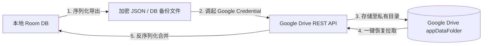

# ListenExpenseTracker - 极简记账

<p align="center">
  
</p>

<p align="center">
  <strong>一款隐私优先、本地优先 (Local-First)、无服务器 (Serverless) 的高颜值 Android 原生记账工具</strong>
</p>

<p align="center">
  <a href="#-功能特性">功能特性</a> •
  <a href="#-架构设计与多模块划分">架构设计</a> •
  <a href="#-技术栈选型">技术栈选型</a> •
  <a href="#-云端同步机制">云端同步</a> •
  <a href="#-快速开始">快速开始</a>
</p>

---

## 📖 项目简介

**ListenExpenseTracker** 旨在打造一款**秒开秒记、零广告插屏、隐私安全**的个人财务追踪应用。

不同于传统依赖云端 API 服务器的记账应用，本应用采用 **本地优先 (Local-First)** 架构：所有账单明细默认保存在手机本地 Room SQLite 数据库中。同时，支持未登录全功能使用，并可通过绑定 Google 账号，利用 **Google Drive REST API (`appDataFolder`)** 将加密数据无缝备份与恢复至用户个人云端驱动器，实现完全无服务器、零运维成本、隐私 100% 掌握在用户手中的高效体验。

---

## 🌟 功能特性 (Feature Specifications)

### 1. 账单流水 (Transactions Stream)
- **头部总览卡片**：实时展示选定时间窗口的**总收入**、**总支出**与**总结余**，提供隐私小眼睛**一键隐额开关**。
- **多维度视图与导航**：支持按日 / 按月 流水维度切换，提供快捷日期步进选择器（前一日/后一日，前一月/后一月）。
- **明细列表**：按日期分组展示账单，包含类目图标与主题色彩、类目名称、备注信息、支付账户标签（微信、支付宝、现金、银行卡等），支出呈红色标示，收入呈绿色标示。
- **快捷交互**：每条账单支持便捷删除与查看，右下角悬浮按钮 (+) 秒级调起记账弹窗。
- **高效记账 BottomSheet**：
  - 支出/收入/转账 标签页切换。
  - 网格化类目图标选择。
  - **自定义计算器键盘 (Custom Keypad)**：支持实时 `+` `-` 算术求和与连续记账。
  - 账户类型 Chip 筛选与备注输入。

### 2. 多维统计与图表 (Visual Statistics)
- **4 种时间窗口**：支持 日 (Daily)、周 (Weekly)、月 (Monthly)、年 (Yearly) 粒度。
- **Canvas 环形占比图 (Donut Chart)**：清晰展示各类目支出金额与百分比，中轴实时显示总金额。
- **收支对比柱状图 (Overview Bar Chart)**：直观对比一段时间内各时间点的支出与收入高低走向。
- **分类排行榜**：按支出金额降序排列分类列表，配套进度条 (LinearProgressIndicator) 与占比显示。
- **统计长图卡片导出**：支持一键将统计周/月/年结报渲染为精美卡片图片，保存至本地相册或一键分享。

### 3. 偏好设置与个性化 (Settings)
- **中日英多语言 (i18n)**：支持 **简体中文 (zh-CN)**、**English (en-US)**、**日本語 (ja-JP)** 一键动态切换，全应用文案即时生效。
- **外观模式**：支持 浅色 (Light Mode)、深色 (Dark/AMOLED Mode) 及 跟随系统 (System Default)。
- **6+ 主题强调色 (Accent Color Palette)**：提供 翡翠绿、海洋蓝、日落橙、高贵紫、玫瑰粉、琥珀黄 动态 Color Token 系统。
- **App 拓展与互动**：
  - 请喝咖啡 ☕ (Buy Me a Coffee 开发者支持弹窗)
  - 分享应用 (Share App 原生 Intent 调起)
  - 给个好评 ⭐ (In-App Review / 应用商店评分)
  - 隐私政策 & 使用条款 (Privacy Policy & Terms of Use)
  - 开源许可 (Open Source Licenses 依赖声明)
  - 检查更新与版本号 (`v1.0.0 (Build 100)`) 展示。

### 4. 未登录离线使用与 Google 云端同步
- **Guest 离线模式**：无需注册或登录，安装后直接本地全功能使用。
- **Google Drive 云端备份与恢复**：授权 Google 登录后，支持一键将本地 Room 数据库安全序列化备份至 Google Drive 的专属私有目录 (`appDataFolder`)，并可随时一键全量恢复，附带上一次同步时间戳。

---

## 🏗️ 架构设计与多模块划分 (Architecture & Modular Design)

项目借鉴现代 Android 模块化设计理念与 Clean Architecture 架构，遵循 **核心抽离 (Core First)** 与 **UI 组件化 (UIKit First)** 原则，将系统解耦拆分为以下组件库：

```mermaid
graph TD
    App[ListenExpenseTracker APP 业务仓库] --> CoreUI[ListenUiComponent 独立组件库项目]
    App --> CoreArch[ListenArch 独立核心架构库项目]
    CoreUI --> CoreArch

    subgraph ListenArch 独立项目 (com.listen.arch)
        CoreArch --> RoomDB[Room 数据库基类 & Base DAO]
        CoreArch --> DataStore[DataStore 偏好设置管理]
        CoreArch --> CloudSync[Google Drive REST Sync Client]
        CoreArch --> I18n[LocaleManager 多语言管理]
        CoreArch --> BaseVM[MVI / UDF ViewModel 基类]
    end

    subgraph ListenUiComponent 独立项目 (com.listen.uicomponent)
        CoreUI --> M3Theme[Material 3 动态 Theme & Accent Color 颜色Token]
        CoreUI --> Keypad[CustomKeypad 通用数字键盘]
        CoreUI --> Charts[Canvas Donut / Bar 图表组件库]
        CoreUI --> Components[CommonCard / CommonBadge / ItemRow]
    end
```

### 独立 SDK 项目架构说明 (Independent Universal Libraries)

为保障核心架构与共通 UI 组件可在未来所有的同架构 Android APP 中无缝复用，将底层能力拆分为 **2 个完全独立的 Android Library 工程**：

| 项目名称 | 包名 / 依赖坐标 | 定位与职责说明 | 独立复用性 |
| :--- | :--- | :--- | :--- |
| **`ListenExpenseTracker`** | `com.listen.listenexpensetracker` | **主 App 业务仓库**：记账 App 业务明细、统计图表、设置页面与应用主入口装配 | 本 App 专属业务仓库 |
| **`ListenArch`** | `com.listen.arch` | **独立核心架构 SDK 仓库**：包含 Room 数据库基类、DataStore 状态、云端同步 Client、多语言 LocaleManager、MVI ViewModel 基类及协程扩展 | **100% 独立开源/私有 SDK 项目** |
| **`ListenUiComponent`** | `com.listen.uicomponent` | **独立 UI 组件 SDK 仓库**：包含 Material 3 基础 Token、深浅色与 Accent 强调色切换器、通用数字键盘、Canvas 图表及通用控件 | **100% 独立开源/私有 SDK 项目** (依赖 `ListenArch`) |

---

## 🛠️ 技术栈选型 (Technology Stack)

| 领域 | 选型技术/库 | 说明 |
| :--- | :--- | :--- |
| **语言** | Kotlin 2.2+ | 标准现代 Kotlin 语法与协程支持 |
| **UI 框架** | Jetpack Compose (Material 3) | 声明式 UI，原生支持 Dynamic Color 与自适应布局 |
| **持久化存储** | Room Database + DataStore | 本地 SQLite 高效 ORM 与 键值偏好持久化 |
| **异步与响应式** | Kotlin Coroutines + Flow | 单向数据流 (Unidirectional Data Flow) 响应式驱动 |
| **架构模式** | Clean Architecture + MVI | ViewModel 状态收口与清晰的模块边界 |
| **云端同步** | Google Drive REST API (`appDataFolder`) | 无服务器 (Serverless) 隐私存储机制 |
| **多语言** | Native Android Resources / LocaleManager | 运行时支持 中/英/日 动态多语言切换 |

---

## 🔄 云端同步机制 (Serverless Cloud Sync Workflow)



- **隐私安全**：`appDataFolder` 仅本 App 拥有访问与读写权限，不会污染用户的普通网盘文件列表，有效防止误删。
- **零成本运维**：完全利用 Google 现有的基础设施，无需开发者自建 API 服务器或承担数据库数据库存储成本。

---

## 🚀 快速开始 (Quick Start)

### 环境要求
- Android Studio Ladybug (2024.2+) 或更高版本
- JDK 17 / Kotlin 2.2+
- Android SDK Min API 24 (Android 7.0+), Target API 36

### 构建与运行
1. 克隆代码仓库：
   ```bash
   git clone https://github.com/Listen/ListenExpenseTracker.git
   cd ListenExpenseTracker
   ```
2. 使用 Gradle 编译 Debug APK：
   ```bash
   ./gradlew assembleDebug
   ```
3. 在 Android Studio 中直接运行 `app` 模块。

---

## 📄 开源许可 (License)

本项目基于 [MIT License](LICENSE) 开源。
