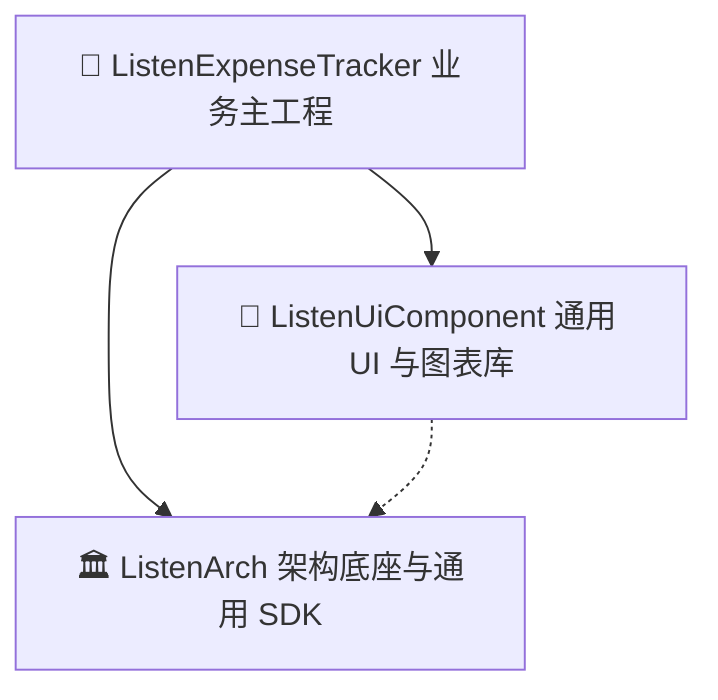

# ListenExpenseTracker (原生 Android 极简记账应用)

`ListenExpenseTracker` 是基于现代 Android 原生技术栈（Kotlin 2.x + Jetpack Compose + MVI + Room Local-First + Google Play Services Auth + Composite Build）打造的高性能、解耦型现代化财务记账应用。

---

## 🌟 核心特性与产品能力

1. **Local-First 离线优先极速记账**：基于 Room SQLite 提供 Flow 响应式数据流，毫秒级冷启动、离线读写与本地全量持久化。
2. **Google 真实账户连携与云端备份恢复**：
   - 接入 Google Play Services Auth SDK，支持调起系统级 Google 账户授权与备选账号选择器。
   - 用户画像与邮箱安全持久化，账号状态在应用重启后自动保持连携。
   - 多账户独立快照隔离存储，云端备份携带 MD5 校验和与 APM 链路耗时打点，支持一键无损云端恢复。
3. **高信息密度流水明细与日聚合视图**：
   - 流水列表按日自动分组 (`20 星期四 2026.08`) 并实时汇总每日总支出与总收入。
   - 极致紧凑的 24dp 圆形分类图标与微型内边距，单屏展示信息量翻倍。
   - 左滑删除 70% 深度防误触，支持 **底部 Snackbar 4 秒内一键撤销 (Undo)** 恢复误删账单。
   - 前景白色卡片与背景删除层 10.dp 几何精确贴合，彻底杜绝圆角红边渗透。
4. **专属年月快速选择器 (`MonthPickerDialog`)**：
   - 独立的年份 `< 2026年 >` 快速切换与 3x4 12 月份方块网格，单次点击直达目标月份，彻底告别冗长的日历选择。
   - 流水与统计页面均集成超轻量居中时间胶囊 (`[ < 2026年08月 > ]`)。
5. **动态收支分类与支付账户管理系统**：
   - **双入口设计**：在记账弹窗分类横向滚动列表末尾提供 `[+ 管理]` 即时入口，并在设置中心提供集中管理入口。
   - 支持自定义分类的新增、重命名与删除，内置系统预设保护。
   - 账户类型（微信/支付宝/银行卡/现金）支持动态拓展与过滤。
6. **多维统计图表与月度预算看板**：
   - 支出 / 收入双模式一键分析切换 (Segmented Toggle)。
   - 自定义 Canvas 环形占比图 (`DonutChart`)、垂直走势柱状图 (`BarChart`) 与分段比例条 (`SegmentedProgressBar`)。
   - 实时计算月度预算消耗比例与剩余预算额度，提供动态超支告警。
7. **全场景多语言与多币种符号体系**：
   - 内置 `StringsRes` 动态本地化字典，无需重启应用即时切换中/英/日三语。
   - 支持 `￥ (CNY/JPY)`, `$ (USD)`, `€ (EUR)`, `£ (GBP)` 币种符号即时切换。
8. **Android 桌面快捷小组件 (AppWidget)**：在手机主屏幕上实时展示今日消费金额并提供一键快速记账入口。
9. **企业级可观测性与 APM 监控**：500 条环形内存日志 (`ApmLogger`)、全链路毫秒耗时打点 (`TraceManager`) 与未捕获异常拦截 (`CrashHandler`)，内置 `LogInspectorSheet` 调试浮窗。

---

## 🏗️ 三层独立工程架构 (Composite Build)

项目采用 Gradle Composite Build (`includeBuild`) 进行物理级仓库解耦，保证基础架构与 UI 组件库可作为独立通用 SDK 被未来的其他 Listen 系列 App 复用：



* **[ListenArch](file:///C:/Users/liste/Downloads/github/ListenArch)**：MVI 模式基类 (`BaseViewModel`)、通用 DataStore 偏好 (`BaseDataStoreManager`)、APM 监控 (`ApmLogger`)、TraceId 链路追踪 (`TraceManager`)、通用 Payload 云端同步引擎 (`CloudSyncManager`) 与通用本地化引擎 (`StringsRes`)。
* **[ListenUiComponent](file:///C:/Users/liste/Downloads/github/ListenUiComponent)**：通用算术数字键盘 (`NumericKeypad`)、Canvas 图表组件 (`DonutChart`, `BarChart`)、通用分段进度条、Material 3 主题系统、SurfaceCard、SearchBarInput 与 APM 日志浮窗。
* **[ListenExpenseTracker](file:///C:/Users/liste/Downloads/github/ListenExpenseTracker)**：主 App 业务编排、Room 本地数据库 (`AppDatabase`, `TransactionDao`, `TransactionEntity`)、记账专属偏好 (`ExpenseDataStoreManager`)、记账多语言字典 (`ExpenseStrings`)、JSON/CSV 备份导入导出 (`TransactionBackupManager`)、Feature-First 业务页面与桌面小组件。

---

## 📚 规范文档矩阵 (`docs/`)

| 文档路径 | 核心内容 |
| :--- | :--- |
| [docs/project_development_guide.md](file:///C:/Users/liste/Downloads/github/ListenExpenseTracker/docs/project_development_guide.md) | 项目开发指南、工程规范与代码风格基线 |
| [docs/api_reference.md](file:///C:/Users/liste/Downloads/github/ListenExpenseTracker/docs/api_reference.md) | 全模块 API、DAO、DataStore Flow、Google Auth 与 SDK 接口手册 |
| [docs/architecture_decision_records.md](file:///C:/Users/liste/Downloads/github/ListenExpenseTracker/docs/architecture_decision_records.md) | 架构决策记录 (ADR-001 ~ ADR-007) 与技术选型权衡 |
| [docs/apm_performance_monitoring_design.md](file:///C:/Users/liste/Downloads/github/ListenExpenseTracker/docs/apm_performance_monitoring_design.md) | APM 性能监控与可观测性设计规范 |
| [docs/repository_caching_strategy.md](file:///C:/Users/liste/Downloads/github/ListenExpenseTracker/docs/repository_caching_strategy.md) | 数据源缓存与 Google 云端快照同步规范 |
| [docs/error_codes_reference.md](file:///C:/Users/liste/Downloads/github/ListenExpenseTracker/docs/error_codes_reference.md) | 错误码收敛与 Kotlin 原生 Result 统一异常处理模型 |
| [docs/custom_lint_rules.md](file:///C:/Users/liste/Downloads/github/ListenExpenseTracker/docs/custom_lint_rules.md) | 静态分析与 Lint 代码审查红线规范 |
| [docs/push_and_widgets_specification.md](file:///C:/Users/liste/Downloads/github/ListenExpenseTracker/docs/push_and_widgets_specification.md) | 桌面 Widget 与本地记账定时提醒通知规格 |
| [docs/todo.md](file:///C:/Users/liste/Downloads/github/ListenExpenseTracker/docs/todo.md) | 演进路线图与全阶段任务追踪清单 (100% Completed) |

---

## 🧪 自动化测试与构建命令

```bash
# 编译全模块 Debug APK
./gradlew assembleDebug

# 运行所有子模块单元测试与覆盖率报告
./gradlew test jacocoTestReport

# 检查依赖树与 Composite Build 状态
./gradlew projects
```
