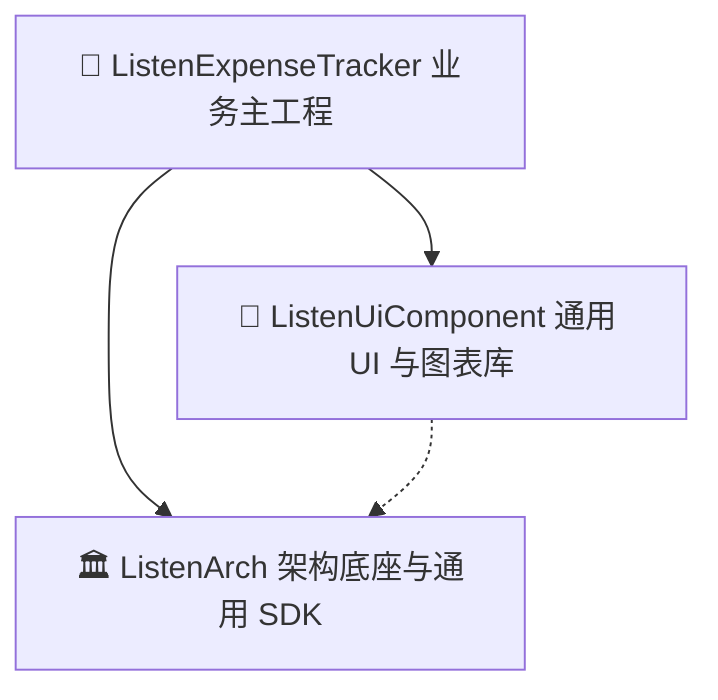

# ListenExpenseTracker (原生 Android 极简记账应用)

`ListenExpenseTracker` 是基于现代 Android 原生技术栈（Kotlin 2.x + Jetpack Compose + MVI + Room Local-First + Composite Build）打造的高性能、解耦型现代化记账 App。

---

## 🌟 核心特性与产品能力

1. **Local-First 离线优先极速记账**：基于 Room SQLite 提供 Flow 响应式数据流，毫秒级冷启动与持久化。
2. **多维流水与收支双维度统计**：
   - 支出 / 收入双模式一键分析切换 (Segmented Toggle)。
   - 自定义 Canvas 环形占比图 (`DonutChart`)、垂直走势柱状图 (`BarChart`) 与分段比例条 (`SegmentedProgressBar`)。
   - 4 维流水智能重排（时间最新 / 时间最早 / 金额降序 / 金额升序）。
   - 关键词搜索与支付账户 (微信/支付宝/银行卡/现金) 过滤 Filter Chips。
3. **月度预算与智能超支告警**：实时计算预算消耗比例，并提供动态超支警示。
4. **全界面中英日三语多语言体系**：内置 `StringsRes` 动态本地化字典，无需重启应用即可即时切换语言。
5. **多币种符号动态适配**：支持 `￥ (CNY/JPY)`, `$ (USD)`, `€ (EUR)`, `£ (GBP)` 自由切换。
6. **Android 桌面快捷小组件 (AppWidget)**：在手机主屏幕上实时展示今日消费金额并提供一键快速记账入口。
7. **数据运维与云端同步**：支持全量 JSON/CSV 账单数据导出、系统分享与一键导入恢复，内置云端同步引擎 (`CloudSyncManager`)。
8. **企业级可观测性与 APM 监控**：500 条环形内存日志 (`ApmLogger`)、全链路毫秒耗时打点 (`TraceManager`) 与未捕获异常拦截 (`CrashHandler`)，内置 `LogInspectorSheet` 调试浮窗。

---

## 🏗️ 三层独立工程架构 (Composite Build)

项目采用 Gradle Composite Build (`includeBuild`) 进行物理级仓库解耦，保证基础架构与 UI 组件库可作为独立通用 SDK 被未来的其他 Listen 系列 App 复用：



* **[ListenArch](file:///C:/Users/liste/Downloads/github/ListenArch)**：MVI 模式基类 (`BaseViewModel`)、Room 数据库、DataStore 偏好管理器、APM 监控、TraceId 链路追踪、云端同步引擎与本地化字典。
* **[ListenUiComponent](file:///C:/Users/liste/Downloads/github/ListenUiComponent)**：算术数字键盘 (`NumericKeypad`)、Canvas 图表组件 (`DonutChart`, `BarChart`)、分段进度条、Material 3 主题与 APM 日志浮窗。
* **[ListenExpenseTracker](file:///C:/Users/liste/Downloads/github/ListenExpenseTracker)**：主 App 业务编排、流水列表、多维统计、设置运维与桌面小组件。

---

## 📚 规范文档矩阵 (`docs/`)

| 文档路径 | 核心内容 |
| :--- | :--- |
| [docs/project_development_guide.md](file:///C:/Users/liste/Downloads/github/ListenExpenseTracker/docs/project_development_guide.md) | 项目开发指南、工程规范与代码风格基线 |
| [docs/api_reference.md](file:///C:/Users/liste/Downloads/github/ListenExpenseTracker/docs/api_reference.md) | 全模块 API、DAO、DataStore Flow 与 SDK 接口参考手册 |
| [docs/architecture_decision_records.md](file:///C:/Users/liste/Downloads/github/ListenExpenseTracker/docs/architecture_decision_records.md) | 架构决策记录 (ADR-001 ~ ADR-004) 与技术选型权衡 |
| [docs/apm_performance_monitoring_design.md](file:///C:/Users/liste/Downloads/github/ListenExpenseTracker/docs/apm_performance_monitoring_design.md) | APM 性能监控与可观测性设计规范 |
| [docs/repository_caching_strategy.md](file:///C:/Users/liste/Downloads/github/ListenExpenseTracker/docs/repository_caching_strategy.md) | 数据源缓存与云端同步降级规范 |
| [docs/error_codes_reference.md](file:///C:/Users/liste/Downloads/github/ListenExpenseTracker/docs/error_codes_reference.md) | 错误码收敛与 Kotlin 原生 Result 统一异常处理模型 |
| [docs/custom_lint_rules.md](file:///C:/Users/liste/Downloads/github/ListenExpenseTracker/docs/custom_lint_rules.md) | 静态分析与 Lint 代码审查红线规范 |
| [docs/push_and_widgets_specification.md](file:///C:/Users/liste/Downloads/github/ListenExpenseTracker/docs/push_and_widgets_specification.md) | 桌面 Widget 与本地记账定时提醒通知规格 |
| [docs/todo.md](file:///C:/Users/liste/Downloads/github/ListenExpenseTracker/docs/todo.md) | 演进路线图与全阶段任务追踪清单 (100% Completed) |

---

## 🧪 自动化测试与构建命令

```bash
# 编译全模块 Debug APK
./gradlew assembleDebug

# 运行所有子模块单元测试
./gradlew test

# 检查依赖树与 Composite Build 状态
./gradlew projects
```
