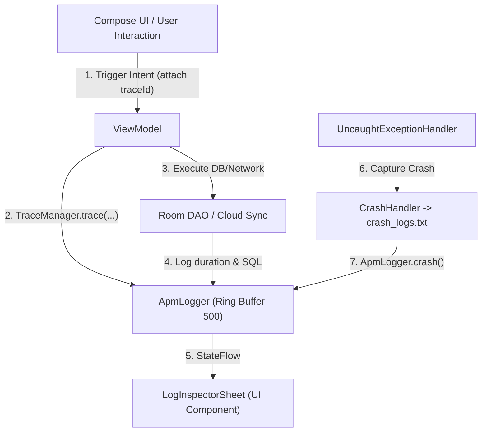
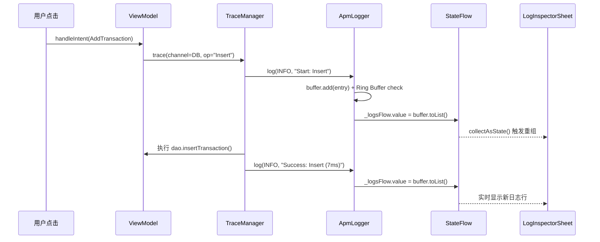

# ListenExpenseTracker - APM 性能监控与可观测性设计规范

本文档规范 `ListenExpenseTracker` 与基础 SDK (`ListenArch` / `ListenUiComponent`) 内置的 **APM (Application Performance Monitoring) 性能监控、日志浮窗与 TraceId 链路追踪体系**。

> 每个模块均附带 **设计思路 (Design Rationale)**、**实现要点 (Implementation Details)** 与 **关键代码解读 (Code Walkthrough)** 说明。

---

## 1. 核心设计哲学 (Core Philosophy)

1. **零外部强依赖**：APM 核心逻辑下沉于通用 SDK `ListenArch` (`com.listen.arch.apm`)，不强依赖 Firebase 或第三方性能监控平台，保证无网环境与私有化部署下的 100% 可用性。
2. **环形内存日志缓冲区 (In-Memory Ring Buffer)**：维护最多 500 条实时日志，避免内存泄漏，同时支持流式 `StateFlow<List<ApmLogEntry>>` 驱动 UI 实时渲染。
3. **全链路 TraceId 追踪**：为用户发起的每个 MVI `Intent` 分配唯一的短 UUID `traceId`（如 `trace-a1b2c3d4`），贯穿 ViewModel、Room SQLite 数据库与云端同步任务，实现精确到毫秒级的耗时打点。
4. **Crash Safe Mode 崩溃保护**：全局拦截未捕获的 Uncaught Exception，持久化崩溃堆栈至本地 `crash_logs.txt`，防止由于偶发空指针或数据库损坏导致 App 无休止闪退。

---

## 2. 架构分层设计



#### 🔑 分层设计思路

| 层级 | 模块位置 | 职责 | 为什么放在这一层 |
|------|---------|------|----------------|
| **数据采集层** | `ListenArch` (`com.listen.arch.apm`) | `ApmLogger`、`TraceManager`、`CrashHandler` | 纯 Kotlin，无 Android UI 依赖，所有 Listen 系列 App 共享 |
| **数据模型层** | `ListenArch` (`com.listen.arch.apm`) | `ApmLogEntry`、`ApmLogChannel`、`ApmLogLevel` | 不可变数据类，无副作用 |
| **UI 渲染层** | `ListenUiComponent` (`com.listen.uicomponent.apm`) | `LogInspectorSheet`、`LogItemRow` | 依赖 Compose UI，需要 Material3 主题 |
| **业务集成层** | `ListenExpenseTracker` (各 ViewModel) | 在 `handleIntent` 中调用 `TraceManager.trace()` | 各 App 按需集成 |

> **设计原则**：采集层（ListenArch）完全不知道 UI 层（ListenUiComponent）的存在。两者之间唯一的桥梁是 `ApmLogger.logsFlow: StateFlow<List<ApmLogEntry>>`。UI 层通过 `collectAsState()` 订阅即可实时渲染，实现了 **发布-订阅 (Pub-Sub)** 解耦。

---

## 3. 源码文件清单与职责

| 文件 | 位置 | 行数 | 核心职责 |
|------|------|------|---------|
| `ApmLogEntry.kt` | ListenArch | 27 行 | 日志数据模型 + 频道/级别枚举定义 |
| `ApmLogger.kt` | ListenArch | 118 行 | 环形缓冲区、日志写入、StateFlow 推送、纯文本导出 |
| `TraceManager.kt` | ListenArch | 31 行 | TraceId 生成 + 自动计时包装器 |
| `CrashHandler.kt` | ListenArch | 46 行 | 全局未捕获异常拦截 + 持久化崩溃日志 |
| `LogInspectorSheet.kt` | ListenUiComponent | 213 行 | 日志浮窗 UI（频道过滤、搜索、导出） |
| `LogInspectorComponents.kt` | ListenUiComponent | 142 行 | 日志行卡片组件 + 色彩编码 |

---

## 4. APM 日志分频道规范 (Log Channels)

| 频道 | `ApmLogChannel` | 采集内容 | 典型调用者 |
| :--- | :--- | :--- | :--- |
| **APP** | `.APP` | ViewModel 调度、用户 Intent 触发、页面导航与状态更新 | `ApmLogger.d()` / `ApmLogger.i()` |
| **DB** | `.DB` | Room 数据库 CRUD、SQL 执行耗时 | `ApmLogger.db()` |
| **SYNC** | `.SYNC` | Google Drive 云端同步、备份/恢复操作 | `ApmLogger.sync()` |
| **CRASH** | `.CRASH` | 全局未处理异常、崩溃线程与堆栈 | `ApmLogger.crash()` / `CrashHandler` |

#### 🔑 为什么要分频道？

在一个运行中的 App 内，业务日志、数据库操作日志和同步日志可能同时产出上百条。如果全部混在一起，排查问题时效率极低。分频道后，开发者在 `LogInspectorSheet` 中可以通过 **FilterChip** 一键过滤，只看关心的频道。例如排查云端同步失败时，直接切到 `SYNC` 频道即可。

---

## 5. 核心模块深度解析

### 5.1 `ApmLogEntry` — 日志数据模型

```kotlin
data class ApmLogEntry(
    val id: String = UUID.randomUUID().toString(),  // 唯一标识，用于 LazyColumn key 高效 diff
    val timestamp: Long = System.currentTimeMillis(), // 创建时间戳
    val level: ApmLogLevel = ApmLogLevel.INFO,       // 日志级别
    val channel: ApmLogChannel = ApmLogChannel.APP,  // 所属频道
    val tag: String = "APM",                          // 来源标签（如 "RoomDB", "CloudSync"）
    val message: String,                              // 日志正文
    val traceId: String? = null,                      // 可选：分布式追踪 ID
    val stackTrace: String? = null                    // 可选：异常堆栈（仅 ERROR/CRASH）
)
```

> **设计要点**：`id` 使用 `UUID.randomUUID()` 自动生成，确保每条日志在 `LazyColumn` 中有唯一 key。Compose 的 `items(key = { it.id })` 依赖这个 key 做高效 diff，避免列表更新时全量重组。

---

### 5.2 `ApmLogger` — 环形缓冲区与响应式日志中枢

#### 🔑 设计思路

`ApmLogger` 是整个 APM 系统的核心中枢，需要同时满足三个看似矛盾的需求：

| 需求 | 挑战 | 解决方案 |
|------|------|---------|
| **高频写入** | 日志可能从主线程、IO 线程、协程并发写入 | `CopyOnWriteArrayList` 线程安全集合 |
| **实时 UI 渲染** | UI 需要每次写入后立即刷新 | `StateFlow<List>` 响应式推送 |
| **内存可控** | 不能让日志无限增长导致 OOM | Ring Buffer 环形缓冲区，上限 500 条 |

#### 💡 关键代码解读

```kotlin
object ApmLogger {
    private const val MAX_LOG_SIZE = 500
    // ---- 为什么用 CopyOnWriteArrayList 而非 synchronized ArrayList？ ----
    // CopyOnWriteArrayList 的特性是「写时复制」：每次 add/remove 时创建底层数组的副本。
    // 这意味着所有正在进行的读操作（如 UI 线程遍历 buffer 做 exportPlainText）
    // 不会被写操作阻塞，也不会抛出 ConcurrentModificationException。
    // 代价是写操作较慢（需要复制数组），但日志写入频率远低于读取频率，因此这个权衡是合理的。
    private val buffer = CopyOnWriteArrayList<ApmLogEntry>()
    
    // ---- StateFlow：从日志到 UI 的响应式桥梁 ----
    // 每次日志写入后，将 buffer 的不可变快照赋值给 StateFlow。
    // UI 层（LogInspectorSheet）通过 collectAsState() 订阅，Compose 自动触发重组。
    private val _logsFlow = MutableStateFlow<List<ApmLogEntry>>(emptyList())
    val logsFlow: StateFlow<List<ApmLogEntry>> = _logsFlow.asStateFlow()

    fun log(level, channel, tag, message, traceId, throwable) {
        // ... 构造 ApmLogEntry ...

        // ---- 环形缓冲区核心逻辑 ----
        if (buffer.size >= MAX_LOG_SIZE) {
            buffer.removeAt(0)  // 移除最旧的条目，保持内存稳定
        }
        buffer.add(entry)
        _logsFlow.value = buffer.toList()  // 分发不可变快照给所有订阅者
        // 注意：toList() 创建了一个新的不可变 List，
        // 这样即使后续 buffer 继续被修改，已分发出去的快照也不会变化，保证 UI 数据一致性。
    }
}
```

#### 📋 快捷方法矩阵

| 方法 | 级别 | 频道 | 典型使用场景 |
|------|------|------|-------------|
| `d(tag, msg)` | DEBUG | APP | 开发调试信息 |
| `i(tag, msg)` | INFO | APP | 业务流程关键节点 |
| `w(tag, msg)` | WARN | APP | 非致命异常/降级 |
| `e(tag, msg, throwable)` | ERROR | APP | 业务异常 |
| `db(tag, msg)` | INFO | DB | Room 数据库操作 |
| `sync(tag, msg)` | INFO | SYNC | 云端同步操作 |
| `crash(tag, msg, throwable)` | ERROR | CRASH | 全局未捕获崩溃 |

---

### 5.3 `TraceManager` — 链路追踪与自动计时

#### 🔑 设计思路

`TraceManager` 的核心理念是**零侵入式耗时打点**：业务代码只需用 `TraceManager.trace { }` 包裹要监控的代码块，即可自动获得：
- 操作开始日志
- 操作成功日志（含执行耗时）
- 操作失败日志（含执行耗时 + 异常信息）

#### 💡 关键代码解读

```kotlin
object TraceManager {
    // ---- 短 TraceId 设计 ----
    // 取 UUID 前 8 位（如 "trace-a1b2c3d4"）而非完整 36 位，
    // 因为日志行宽有限，完整 UUID 会导致消息被截断，可读性差。
    // 8 位十六进制 = 4.3 亿种组合，对单次应用会话内的追踪已足够唯一。
    fun newTraceId(): String = "trace-" + UUID.randomUUID().toString().take(8)

    // ---- 为什么声明为 inline？ ----
    // trace() 在热路径中被频繁调用（每次 DB 操作、每次同步都会调用）。
    // inline 避免了每次调用时为 Lambda 创建匿名类对象，减少 GC 压力。
    inline fun <T> trace(
        channel: ApmLogChannel = ApmLogChannel.APP,
        tag: String = "Trace",
        operationName: String,
        traceId: String = newTraceId(),
        block: (traceId: String) -> T    // 将 traceId 传给 block，方便下游继续透传
    ): T {
        val start = System.currentTimeMillis()
        ApmLogger.i(channel, tag, "[$traceId] Start: $operationName", traceId)
        return try {
            val result = block(traceId)          // 执行业务逻辑
            val duration = System.currentTimeMillis() - start
            // 成功时记录耗时（毫秒级）
            ApmLogger.i(channel, tag, "[$traceId] Success: $operationName (${duration}ms)", traceId)
            result
        } catch (e: Throwable) {
            val duration = System.currentTimeMillis() - start
            // 失败时记录耗时 + 异常信息 + 完整堆栈
            ApmLogger.e(channel, tag, "[$traceId] Failed: $operationName (${duration}ms) - ${e.message}", traceId, e)
            throw e  // 重新抛出，不吞掉异常
        }
    }
}
```

#### 📋 业务使用示例

```kotlin
// ---- ViewModel 中插入账单的完整链路追踪 ----
suspend fun addTransaction(entity: TransactionEntity) {
    TraceManager.trace(
        channel = ApmLogChannel.DB,
        tag = "RoomDB",
        operationName = "InsertTransaction"
    ) { traceId ->  // traceId 自动生成，可在 block 内传给下游
        dao.insertTransaction(entity)
        ApmLogger.db(message = "Inserted: ${entity.categoryName} ¥${entity.amount}", traceId = traceId)
    }
}
```

**日志输出**：
```text
[15:30:12.108][DB][INFO][RoomDB] [trace-f8a192c3] Start: InsertTransaction
[15:30:12.115][DB][INFO][RoomDB] [trace-f8a192c3] Success: InsertTransaction (7ms)
[15:30:12.116][DB][INFO][RoomDB] [trace-f8a192c3] Inserted: 餐饮 ¥35.5
```

> 三条日志共享同一个 `trace-f8a192c3`，排查时可通过 TraceId 关联整个操作链。

---

### 5.4 `CrashHandler` — 崩溃保护与持久化

#### 🔑 设计思路

`CrashHandler` 采用**双写策略 (Dual-Write Strategy)**：

| 写入目标 | 存活周期 | 作用 |
|---------|---------|------|
| `ApmLogger.crash()` (内存) | 当前会话 | 崩溃后如果 App 未被 kill，可在 LogInspector 中查看 |
| `crash_logs.txt` (文件) | 跨会话持久化 | 下次启动后仍可读取历史崩溃记录 |

#### 💡 关键代码解读

```kotlin
object CrashHandler {
    private var isInitialized = false  // 幂等性保护，防止重复注册

    fun init(context: Context) {
        if (isInitialized) return       // 多次调用 init 不会重复注册
        isInitialized = true

        // ---- 责任链模式 (Chain of Responsibility) ----
        // 先保存系统默认的异常处理器，我们处理完后还要把异常交给它
        // 这样系统的默认行为（弹 ANR 对话框、上报 Google Play Vitals）不会丢失
        val defaultHandler = Thread.getDefaultUncaughtExceptionHandler()
        Thread.setDefaultUncaughtExceptionHandler { thread, throwable ->
            handleCrash(thread, throwable, context.filesDir)  // 我方处理：双写
            defaultHandler?.uncaughtException(thread, throwable)  // 交还系统处理
        }
    }

    fun handleCrash(thread: Thread, throwable: Throwable, targetDir: File?): String {
        return try {
            // ---- 最外层 try-catch 的设计意义 ----
            // CrashHandler 自身绝对不能抛异常！
            // 如果崩溃处理器本身再崩溃，会导致无限递归崩溃循环。
            val sw = StringWriter()
            throwable.printStackTrace(PrintWriter(sw))
            val stackTrace = sw.toString()

            // 写入 1：内存（当前会话可见）
            ApmLogger.crash("UncaughtException", "Crash in thread ${thread.name}: ${throwable.message}", throwable)

            // 写入 2：文件（跨会话持久化）
            if (targetDir != null) {
                val file = File(targetDir, "crash_logs.txt")
                val record = "--- CRASH [${sdf.format(Date())}] Thread: ${thread.name} ---\n$stackTrace\n\n"
                file.appendText(record)  // appendText：追加模式，崩溃历史不会被覆盖
            }
            stackTrace
        } catch (e: Exception) {
            e.printStackTrace()  // 静默失败，绝不抛异常
            ""
        }
    }
}
```

---

### 5.5 `LogInspectorSheet` — 实时日志浮窗

#### 🔑 设计思路

`LogInspectorSheet` 是一个 **ModalBottomSheet**，为开发者提供应用内实时日志查看能力，无需连接电脑查看 Logcat。关键设计决策：

| 决策 | 原因 |
|------|------|
| `skipPartiallyExpanded = true` | 避免半展开态，日志内容较多需要全屏展示 |
| `fillMaxHeight(0.85f)` | 保留 15% 顶部间隙，用户可以看到父页面，感知"这是一个浮窗" |
| `LazyColumn(key = { it.id })` | 利用 ApmLogEntry 的 UUID key 做高效 diff，新日志追加时不重组旧条目 |
| 语言 `when` 解构赋值 | 不依赖 Android Resources，纯 Kotlin 多语言，可在任何层调用 |

#### 💡 关键代码解读

```kotlin
@Composable
fun LogInspectorSheet(logs, onClearLogs, onExportLogs, onDismiss, lang) {
    // ---- 双层过滤管线 ----
    var selectedChannel by remember { mutableStateOf<String?>(null) }  // 频道过滤
    var searchQuery by remember { mutableStateOf("") }                  // 文本搜索

    val filteredLogs = logs.filter { entry ->
        // 第 1 层：频道过滤（null = 全部）
        val channelMatch = selectedChannel == null || entry.channelName == selectedChannel
        // 第 2 层：关键词搜索（跨 message / tag / traceId 三个字段）
        val queryMatch = searchQuery.isBlank() ||
                entry.message.contains(searchQuery, ignoreCase = true) ||
                entry.tag.contains(searchQuery, ignoreCase = true) ||
                (entry.traceId?.contains(searchQuery, ignoreCase = true) == true)
        channelMatch && queryMatch
    }

    // ---- 轻量级多语言：解构赋值 Tuple5 ----
    // 不使用 Android string resources，因为 UI 组件层不应强依赖宿主 App 的 res 文件
    val (titleText, clearText, exportText, placeholderText, emptyText) = when (lang) {
        "en" -> Tuple5("APM Logs & Observability", "Clear", "Export", ...)
        "ja" -> Tuple5("APM ログと観測性", "消去", "エクスポート", ...)
        else -> Tuple5("APM 性能与日志", "清空", "导出", ...)
    }

    // FilterChip 频道过滤器：显示每个频道的日志计数
    // 例如 "APP (42)" / "DB (15)" / "SYNC (3)" / "CRASH (1)"
    channels.forEach { channel ->
        val count = logs.count { it.channelName == channel }
        FilterChip(
            selected = selectedChannel == channel,
            onClick = { selectedChannel = channel },
            label = { Text("$channel ($count)") }
        )
    }
}
```

---

### 5.6 `LogItemRow` — 日志行卡片

#### 🔑 色彩编码系统

每条日志按级别赋予不同颜色，实现视觉优先级分层：

| 级别 | 颜色 | 视觉效果 | 设计意图 |
|------|------|---------|---------|
| `DEBUG` | Gray | 最弱 | 调试信息，正常运行时不需关注 |
| `INFO` | Green (IncomeGreen) | 正面 | 正常流程，一切顺利 |
| `WARN` | Amber (#F59E0B) | 警告 | 需要关注但非致命 |
| `ERROR` | Red (ExpenseRed) | 醒目 | 必须立即排查 |

```kotlin
// ---- 关键渲染细节 ----
// 1. 使用 FontFamily.Monospace 渲染消息和堆栈，保证等宽对齐便于阅读
// 2. stackTrace 限制 maxLines = 6，避免单条崩溃日志占满整个列表
// 3. 卡片使用 surfaceVariant.copy(alpha = 0.5f) 半透明背景，视觉轻量不压迫
```

---

## 6. 完整数据流时序图



---

## 7. 日志导出与系统分享

在 `LogInspectorSheet` 中提供 **「导出」** 与 **「清空」** 功能：

| 操作 | 实现方式 | 输出格式 |
|------|---------|---------|
| **导出** | `ApmLogger.exportPlainText()` + `Intent.ACTION_SEND` | 纯文本（见下方格式） |
| **清空** | `ApmLogger.clear()` | 清空内存缓冲区 + StateFlow |

**导出格式**：
```text
[15:30:12.108][DB][INFO][RoomDB] [trace-f8a192c3] Start: InsertTransaction
[15:30:12.115][DB][INFO][RoomDB] [trace-f8a192c3] Success: InsertTransaction (7ms)
[15:30:12.230][SYNC][INFO][CloudSync] [trace-b4e7a912] Start: BackupToCloud
[15:30:12.350][SYNC][INFO][CloudSync] [trace-b4e7a912] Success: BackupToCloud (120ms)
```

格式设计原则：`[时间][频道][级别][标签] [追踪ID] 消息`，每个字段用方括号包裹，便于正则解析和日志分析工具导入。

---

## 8. 技术难点总结

| # | 难点 | 解决方案 | 相关代码 |
|---|------|---------|---------|
| 1 | 多线程并发写入日志 | `CopyOnWriteArrayList` 写时复制，读不加锁 | `ApmLogger.buffer` |
| 2 | UI 实时刷新不卡顿 | `StateFlow` + `buffer.toList()` 不可变快照 | `ApmLogger._logsFlow` |
| 3 | 内存无限增长 | Ring Buffer 上限 500 条，`removeAt(0)` 淘汰最旧 | `ApmLogger.log()` |
| 4 | TraceId 可读性 vs 唯一性 | 截取 UUID 前 8 位（4.3 亿种组合） | `TraceManager.newTraceId()` |
| 5 | trace() 高频调用性能 | `inline` 函数消除 Lambda 对象分配 | `TraceManager.trace()` |
| 6 | 崩溃处理器自身不能崩溃 | 最外层 try-catch 静默失败 | `CrashHandler.handleCrash()` |
| 7 | 崩溃记录跨会话保留 | 双写策略：内存 + 文件 `appendText` | `CrashHandler.handleCrash()` |
| 8 | UI 组件层多语言 | `Tuple5` 解构赋值，不依赖 Android Resources | `LogInspectorSheet` |

