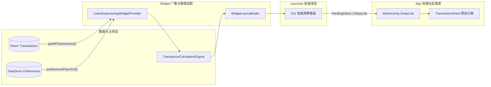
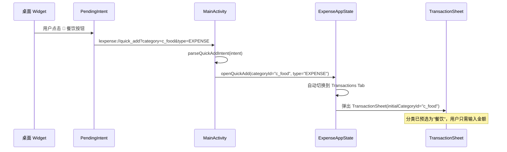

# 桌面小部件体验 2.0 设计与实现规范 (App Widget 2.0 Specification)

> 每个模块均附带 **设计思路 (Design Rationale)**、**实现要点 (Implementation Details)** 与 **关键代码解读 (Code Walkthrough)** 说明。

## 1. 概述 (Overview)

### 1.1 背景与痛点
目前用户记账必须解锁手机、查找 App 图标、点击打开主界面、点击记账按钮、选择分类、输入金额，全流程通常耗时 5~10 秒。当在超市、地铁闸机、餐厅等碎片化即时消费场景下，过长的记账路径容易导致用户放弃记账。

### 1.2 核心目标
1. **2 秒闪电快捷记账**：在桌面小组件直接提供高频分类图标（🍔 餐饮、🚗 交通、🛍️ 购物、📦 杂项），轻触一键拉起记账弹窗并预选分类与默认账户。
2. **5x2 智能预算看板**：实时呈现本月总支出、剩余预算额度、收支进度与三态健康度（正常/预警/超支）。
3. **响应式数据联动与 Material You 动态适配**：数据变更时毫秒级自动更新，自适应系统深浅色与动态主题。

---

## 2. 架构与通信机制 (Architecture & Data Flow)



#### 🔑 架构设计思路

| 设计决策 | 原因 |
|---------|------|
| **Provider + LayoutBinder 分离** | `ListenExpenseAppWidgetProvider`（301 行）负责数据流与状态管理，`WidgetLayoutBinder`（130 行）负责 RemoteViews UI 渲染，遵循单一职责，单文件不超过 250 行规范 |
| **使用 `CoroutineScope(Dispatchers.IO)` 而非 `viewModelScope`** | Widget 运行在 BroadcastReceiver 上下文中，没有 ViewModel 可用，必须创建独立协程作用域 |
| **`updatePeriodMillis = 0`（零轮询）** | 彻底摒弃系统定时刷新，改为数据变更驱动（Flow 收集 → `updateFromTransactions()`），最大化省电 |
| **SharedPreferences 存储 per-widget 状态** | 每个桌面小组件实例可以独立显示不同月份、独立切换隐额状态，Key 格式 `widget_month_offset_{widgetId}` |

---

## 3. 源码文件清单与职责

| 文件 | 行数 | 核心职责 |
|------|------|---------|
| `ListenExpenseAppWidgetProvider.kt` | 301 行 | 广播接收、数据流管理、Intent 路由、状态持久化、健康度计算 |
| `WidgetLayoutBinder.kt` | 130 行 | RemoteViews 布局绑定、动态字号、三态进度条、防误触策略 |
| `widget_expense_overview.xml` | — | 5x2 布局：左侧仪表盘 + 右侧 4 分类按钮 |
| `listen_expense_widget_info.xml` | 11 行 | 元数据配置：5x2 单元格、零轮询、水平+垂直可缩放 |
| `colors_widget.xml` + `values-night/` | 39+39 行 | 浅色/深色双调色盘 |
| `widget_badge_*.xml` / `widget_progress_*.xml` | — | 三态徽章背景 + 三态进度条 Drawable |

---

## 4. 小组件规格与交互设计 (Widget Layout & Interaction)

### 4.1 5x2 智能预算看板 (Smart Budget & Quick Actions Widget)
* **左侧：收支与预算健康仪表**：
  * **第一行（状态与控制行）**：应用图标、小眼睛一键隐额切换按键（40x32dp 大靶心）与三态健康度微徽章（`正常`/`预警`/`超支`）。
  * **第二行（月份导航行）**：上一月切换箭头（40x34dp 无缝满格）、当前月份标题（如 `2026年09月`）、下一月切换箭头（40x34dp 无缝满格）。
  * **第三行（支出金额行）**：支出标签（如 `支出`）与当月总支出金额（如 `￥3,540.00`）同级并列，阶梯式动态降阶字号自适应。
  * **第四行（预算与进度条）**：剩余可用预算（如 `剩余 ￥1,460.00`），三态线性进度条动态变色。
* **右侧：4 大高频闪电分类记账按钮**：
  * 🍔 **餐饮** (`c_food`) · 🚗 **交通** (`c_transport`) · 🛍️ **购物** (`c_shopping`) · 📦 **日用** (`c_other_exp`)
  * 底部 `+ 记一笔` 通用入口。

---

## 5. 核心模块深度解析

### 5.1 `ListenExpenseAppWidgetProvider` — 数据流与状态管理

#### 🔑 设计思路

Provider 是 Widget 的"大脑"，但它运行在 `BroadcastReceiver` 生命周期中（`onReceive` / `onUpdate`），没有 Activity、没有 ViewModel、没有 Compose。它需要：

1. **异步读取数据库和偏好** → 用 `CoroutineScope(Dispatchers.IO)`
2. **管理 per-widget 状态** → 用 `SharedPreferences` + widgetId 后缀
3. **路由快捷记账 DeepLink** → 构造 `PendingIntent` + `lexpense://quick_add` URI

#### 💡 关键代码解读

```kotlin
// ---- 1. 自定义广播：Widget 内部状态机 ----
// 月份切换和隐额切换不需要打开 App，在 Widget 内部自闭环处理
override fun onReceive(context: Context, intent: Intent) {
    super.onReceive(context, intent)
    when (intent.action) {
        ACTION_PREV_MONTH -> {
            // 从 SharedPreferences 读取当前偏移量，-1 后写回，触发重新渲染
            val currentOffset = getWidgetMonthOffset(context, widgetId)
            setWidgetMonthOffset(context, widgetId, currentOffset - 1)
            triggerWidgetUpdate(context, widgetId)  // 重新从 DB 取数据渲染
        }
        ACTION_TOGGLE_HIDE_AMOUNT -> {
            // 切换"小眼睛"隐额状态：true ↔ false
            val currentHide = getWidgetHideAmount(context, widgetId)
            setWidgetHideAmount(context, widgetId, !currentHide)
            triggerWidgetUpdate(context, widgetId)
        }
    }
}

// ---- 2. 冷启动/添加小组件时的数据加载 ----
override fun onUpdate(context, appWidgetManager, appWidgetIds) {
    // 没有 ViewModel，必须手动创建协程作用域
    CoroutineScope(Dispatchers.IO).launch {
        try {
            val allList = db.transactionDao().getAllTransactions()
            val prefs = prefManager.preferencesFlow.first()  // 一次性取快照
            for (id in appWidgetIds) {
                updateSingleWidget(context, manager, id, allList, ...)
            }
        } catch (_: Exception) {
            // 兜底渲染：即使 DB 访问失败，Widget 也不会显示空白
            // 使用默认数据（支出=0, 预算=5000, 月份=当月）渲染
            for (id in appWidgetIds) {
                WidgetLayoutBinder.renderWidget(context, manager, id, 0.0, 5000.0, ...)
            }
        }
    }
}
```

#### 📋 PendingIntent requestCode 唯一性策略

```kotlin
// ---- 为什么 requestCode 要用 widgetId * 10 + N？ ----
// Android 系统根据 requestCode + Intent 内容来判断 PendingIntent 是否相同。
// 如果两个 Widget 实例使用相同的 requestCode，系统会复用同一个 PendingIntent，
// 导致点击 Widget A 的按钮却触发了 Widget B 的操作。
// 乘以 10 再加偏移量（1=左箭头, 2=右箭头, 3=小眼睛），确保每个实例的每个按钮独享唯一 code。

fun createPrevMonthPendingIntent(context, widgetId) = PendingIntent.getBroadcast(
    context, widgetId * 10 + 1, intent, FLAG_UPDATE_CURRENT or FLAG_IMMUTABLE
)
fun createNextMonthPendingIntent(context, widgetId) = PendingIntent.getBroadcast(
    context, widgetId * 10 + 2, intent, FLAG_UPDATE_CURRENT or FLAG_IMMUTABLE
)
fun createToggleEyePendingIntent(context, widgetId) = PendingIntent.getBroadcast(
    context, widgetId * 10 + 3, intent, FLAG_UPDATE_CURRENT or FLAG_IMMUTABLE
)
```

#### 📋 分类别名标准化 (Backward Compatibility)

```kotlin
// 历史版本使用 "cat_food" 前缀，当前版本使用 "c_food" 前缀。
// normalizeCategoryId 确保无论从哪个版本的 DeepLink 进入，都能正确映射到当前分类 ID。
fun normalizeCategoryId(raw: String?): String? = when (raw) {
    "cat_food",     "c_food"      -> "c_food"       // 餐饮
    "cat_transport","c_transport"  -> "c_transport"  // 交通
    "cat_shopping", "c_shopping"   -> "c_shopping"   // 购物
    "cat_daily", "cat_other", "c_other_exp" -> "c_other_exp"  // 日用/杂项
    else -> raw  // 自定义分类原样透传
}
```

#### 📋 DeepLink 双源解析 (Belt-and-Suspenders)

```kotlin
// ---- 为什么同时检查 URI 和 Intent Extras？ ----
// 不同 Android Launcher（MIUI、OneUI、Pixel Launcher）对 PendingIntent 的传递行为不一致。
// 部分 Launcher 可能丢失 URI data，但保留 extras；反之亦然。
// 因此在 createQuickAddPendingIntent 中双写（URI + extras），
// 在 parseQuickAddIntent 中双读（先读 URI，读不到就读 extras），确保 100% 兼容。
fun parseQuickAddIntent(intent: Intent?): Pair<String?, String>? {
    val uri = intent?.data
    val isQuickAddUri = uri?.scheme == URI_SCHEME && uri?.host == URI_HOST_QUICK_ADD
    val isQuickAddExtra = intent?.hasExtra(EXTRA_QUICK_ADD_CATEGORY) == true
    if (!isQuickAddUri && !isQuickAddExtra) return null

    // 优先从 URI 读取，fallback 到 extras
    val rawCategory = uri?.getQueryParameter(PARAM_CATEGORY)
        ?: intent?.getStringExtra(EXTRA_QUICK_ADD_CATEGORY)
    val type = uri?.getQueryParameter(PARAM_TYPE)
        ?: intent?.getStringExtra(EXTRA_QUICK_ADD_TYPE) ?: "EXPENSE"
    return Pair(normalizeCategoryId(rawCategory), type)
}
```

---

### 5.2 `WidgetLayoutBinder` — RemoteViews 渲染引擎

#### 🔑 设计思路

`WidgetLayoutBinder` 是纯渲染层，接收计算好的数据，输出 `RemoteViews`。它需要解决 RemoteViews 的三个核心限制：

| RemoteViews 限制 | 解决方案 |
|-----------------|---------|
| **不支持 `autoSizeTextType`** | 阶梯式动态降阶字号（按文本长度分 5 档） |
| **不能运行时修改 ProgressBar 颜色** | 预定义 3 条 ProgressBar（绿/琥珀/红），按状态显隐切换 |
| **不支持 Compose** | 传统 XML 布局 + `setTextViewText` / `setOnClickPendingIntent` |

#### 💡 关键代码解读

```kotlin
// ---- 阶梯式动态降阶字号 (技术难点) ----
// RemoteViews 不支持 autoSizeTextType，如果不处理，长金额（如 ￥1,234,567.89）
// 在固定宽度的 Widget 中会被截断为 "￥1,234,5..."
// 解决方案：根据格式化后的金额字符串长度，分 5 档手动设置字号
val targetSpentSp = when {
    formattedSpent.length <= 6  -> if (isEn) 16.5f else 18f    // ￥0 ~ ￥999 或 ••••
    formattedSpent.length <= 8  -> if (isEn) 14.5f else 15.5f  // ￥1,234
    formattedSpent.length <= 10 -> if (isEn) 12f   else 13f    // ￥12,345
    formattedSpent.length <= 12 -> 10.5f                        // ￥123,456
    else -> 9.5f                                                 // 百万级大金额
}
// 注意：英文环境下字号略小，因为英文字符比中文字符宽
views.setTextViewTextSize(R.id.widget_spent_amount, TypedValue.COMPLEX_UNIT_SP, targetSpentSp)
```

```kotlin
// ---- 三态进度条显隐切换 (技术难点) ----
// 为什么不用一个 ProgressBar 动态改色？
// 因为 RemoteViews 不支持 setProgressTintList()！
// 只能在 XML 中预定义 3 条 ProgressBar，每条使用不同的 Drawable tint：
//   widget_progress_normal.xml  → 绿色 (#10B981)
//   widget_progress_warning.xml → 琥珀色 (#F59E0B)
//   widget_progress_over.xml    → 红色 (#EF4444)
// 运行时只显示一条，其余两条 GONE
views.setViewVisibility(R.id.widget_budget_progress_normal,
    if (health == BudgetHealthStatus.NORMAL) View.VISIBLE else View.GONE)
views.setViewVisibility(R.id.widget_budget_progress_warning,
    if (health == BudgetHealthStatus.WARNING) View.VISIBLE else View.GONE)
views.setViewVisibility(R.id.widget_budget_progress_over,
    if (health == BudgetHealthStatus.OVERBUDGET) View.VISIBLE else View.GONE)

// 只给可见的那条设置进度值
views.setProgressBar(activeProgressBarId, 100, progressPercent, false)
```

```kotlin
// ---- 防误触架构 (技术难点) ----
// 早期版本在 Widget 根布局绑定了 openApp PendingIntent：
//     views.setOnClickPendingIntent(R.id.widget_root, openAppPendingIntent)  // ❌ 已移除
// 问题：用户手指在小组件边缘滑动时，容易误触根布局导致意外打开 App。
// 解决：只在核心内容区域精确绑定（金额、预算、月份标题、应用图标、健康徽章），
// 箭头按钮和快捷分类按钮各有自己的专属 PendingIntent，不会冒泡到根布局。
views.setOnClickPendingIntent(R.id.widget_spent_container, openAppPendingIntent)  // ✅ 金额区域
views.setOnClickPendingIntent(R.id.widget_month_title, openAppPendingIntent)      // ✅ 月份标题
views.setOnClickPendingIntent(R.id.widget_app_icon, openAppPendingIntent)         // ✅ 应用图标
// 根布局和外层 Card 不绑定任何 Intent → 点击空白区域无响应 → 防误触
```

---

### 5.3 健康度判定算法

```kotlin
// 三态阈值设计：
// - NORMAL:     ratio < 0.8（预算使用不到 80%，安全）
// - WARNING:    0.8 ≤ ratio < 1.0（即将超支，琥珀色预警）
// - OVERBUDGET: ratio ≥ 1.0（已超支，红色告警）
fun calculateHealthStatus(spent: Double, budget: Double): BudgetHealthStatus {
    if (budget <= 0.0) return BudgetHealthStatus.NORMAL  // 未设预算，不判定
    val ratio = (spent / budget).toFloat()
    return when {
        spent >= budget -> BudgetHealthStatus.OVERBUDGET
        ratio >= 0.8f   -> BudgetHealthStatus.WARNING
        else            -> BudgetHealthStatus.NORMAL
    }
}
```

#### 📋 三态色彩系统

| 状态 | 文本 | 进度条颜色 | 徽章背景 | 徽章文字色 |
|------|------|-----------|---------|-----------|
| **正常** | `正常`/`Normal` | `#10B981` 绿色 | `#DCFCE7` 浅绿 | `#10B981` |
| **预警** | `预警`/`Warning` | `#F59E0B` 琥珀色 | `#FEF3C7` 浅黄 | `#F59E0B` |
| **超支** | `超支`/`Over` | `#EF4444` 红色 | `#FEE2E2` 浅红 | `#EF4444` |

---

## 6. DeepLink 路由完整流程



### 6.1 PendingIntent 构造（Widget 侧）

```kotlin
fun createQuickAddPendingIntent(context, categoryId, requestCode, type) =
    PendingIntent.getActivity(
        context, requestCode,
        Intent(context, MainActivity::class.java).apply {
            action = Intent.ACTION_VIEW
            // 双写策略：URI + extras，确保各 Launcher 兼容
            data = "lexpense://quick_add?category=$categoryId&type=$type".toUri()
            putExtra(EXTRA_QUICK_ADD_CATEGORY, categoryId)
            putExtra(EXTRA_QUICK_ADD_TYPE, type)
            flags = FLAG_ACTIVITY_NEW_TASK or FLAG_ACTIVITY_CLEAR_TOP
        },
        FLAG_UPDATE_CURRENT or FLAG_IMMUTABLE  // Android 12+ 必须 IMMUTABLE
    )
```

### 6.2 MainActivity 意图解析（App 侧）

```kotlin
LaunchedEffect(intentUri) {
    intentUri?.let { uri ->
        if (uri.scheme == "lexpense" && uri.host == "quick_add") {
            val categoryId = uri.getQueryParameter("category") ?: "c_food"
            val type = uri.getQueryParameter("type") ?: "EXPENSE"
            viewModel.handleIntent(TransactionsIntent.OpenQuickAdd(categoryId, type))
        }
    }
}
```

---

## 7. 性能与能耗优化 (Performance & Battery Guards)

| 策略 | 实现方式 | 效果 |
|------|---------|------|
| **零轮询 (Zero-Polling)** | `updatePeriodMillis = 0`，仅 Flow 收集器触发 `updateFromTransactions()` | 无后台定时器，最大化省电 |
| **按需刷新** | 数据库写入/删除/更新时，ViewModel 的 Flow 收集器调用 `updateFromTransactions()` | 数据变更毫秒级同步到 Widget |
| **冷启动补偿** | `onUpdate()` 在 Widget 添加到桌面时自动触发一次完整数据加载 | 避免新添加 Widget 显示空白 |
| **异常兜底** | `try-catch` 渲染默认值（支出=0, 预算=5000） | DB 损坏时 Widget 不会显示空白 |

```kotlin
// ---- 响应式流触发 Widget 刷新 ----
// 在 ViewModel 中监听 TransactionDao 的 Flow，当数据变更时自动更新所有 Widget 实例
fun updateFromTransactions(context, allList, currencySymbol, monthlyBudget, lang) {
    val appWidgetManager = AppWidgetManager.getInstance(context)
    val componentName = ComponentName(context, ListenExpenseAppWidgetProvider::class.java)
    val appWidgetIds = appWidgetManager.getAppWidgetIds(componentName)
    // 遍历桌面上所有该类型的 Widget 实例
    for (appWidgetId in appWidgetIds) {
        updateSingleWidget(context, appWidgetManager, appWidgetId, allList, ...)
    }
}
```

---

## 8. Widget 元数据配置

```xml
<appwidget-provider
    android:minWidth="310dp"           <!-- 最小宽度 310dp ≈ 5 列 -->
    android:minHeight="110dp"          <!-- 最小高度 110dp ≈ 2 行 -->
    android:targetCellWidth="5"        <!-- Android 12+ 精确声明 5 列 -->
    android:targetCellHeight="2"       <!-- Android 12+ 精确声明 2 行 -->
    android:updatePeriodMillis="0"     <!-- 零轮询！由 Flow 驱动刷新 -->
    android:resizeMode="horizontal|vertical"  <!-- 允许用户自由缩放 -->
    android:widgetCategory="home_screen" />   <!-- 仅桌面，不支持锁屏 -->
```

---

## 9. 深浅色自适应调色盘

| 用途 | 浅色模式 | 深色模式 |
|------|---------|---------|
| Widget 背景 | `#FFFFFF` 纯白 | `#1E293B` 深蓝灰 |
| 边框 | `#E2E8F0` 浅灰 | `#334155` 深灰 |
| 主文本 | `#0F172A` 深黑 | `#F1F5F9` 亮白 |
| 次要文本 | `#64748B` 灰色 | `#94A3B8` 浅灰 |
| 餐饮按钮背景 | `#FEE2E2` 浅红 | `#450A0A` 深红 |
| 交通按钮背景 | `#DBEAFE` 浅蓝 | `#172554` 深蓝 |
| 购物按钮背景 | `#FCE7F3` 浅粉 | `#4A0D2E` 深粉 |

> 所有颜色均在 `colors_widget.xml`（浅色）和 `values-night/colors_widget.xml`（深色）中成对定义，Android 系统自动切换。

---

## 10. 技术难点总结

| # | 难点 | 解决方案 | 相关代码 |
|---|------|---------|---------|
| 1 | RemoteViews 不支持 autoSizeText | 5 档阶梯式动态降阶字号 | `WidgetLayoutBinder.renderWidget()` |
| 2 | RemoteViews 不支持运行时修改进度条颜色 | 3 条 ProgressBar 预定义不同 tint，按状态显隐 | `WidgetLayoutBinder` 三态显隐逻辑 |
| 3 | Widget 没有 ViewModel 可用 | `CoroutineScope(Dispatchers.IO)` 独立协程作用域 | `onUpdate()` / `triggerWidgetUpdate()` |
| 4 | 多个 Widget 实例 PendingIntent 冲突 | `requestCode = widgetId * 10 + N` 唯一编码 | `createPrevMonthPendingIntent()` 等 |
| 5 | 各 Launcher 对 PendingIntent 传递不一致 | URI + extras 双写双读 (Belt-and-Suspenders) | `createQuickAddPendingIntent()` / `parseQuickAddIntent()` |
| 6 | Widget 边缘误触打开 App | 仅在内容区域绑定 openApp Intent，不绑根布局 | `WidgetLayoutBinder` 防误触绑定 |
| 7 | 历史版本分类 ID 不兼容 | `normalizeCategoryId()` 别名映射 | `ListenExpenseAppWidgetProvider` |
| 8 | DB 异常时 Widget 显示空白 | `try-catch` 兜底渲染默认数据 | `onUpdate()` |

---

## 11. 落地实现与工程文件映射 (Implementation Status & File Mapping)

本规范已在代码库中 100% 完整落地与测试验证，核心落地代码映射如下：

| 模块 / 职责 | 对应实现文件 | 说明 |
| :--- | :--- | :--- |
| **Provider 调度与数据流** | `ListenExpenseAppWidgetProvider.kt` | 广播接收、数据加载、健康度判定、Intent 路由 |
| **布局渲染引擎** | `WidgetLayoutBinder.kt` | RemoteViews 绑定、动态字号、三态进度条 |
| **小部件 XML 布局** | `widget_expense_overview.xml` | 5x2 左右分区布局 |
| **配置元数据** | `listen_expense_widget_info.xml` | `updatePeriodMillis="0"`, 5x2 单元格 |
| **深浅色主题** | `colors_widget.xml` & `values-night/` | 双调色盘自适应 |
| **DeepLink 与路由** | `MainActivity.kt` & `AndroidManifest.xml` | singleTop 接收 `lexpense://quick_add` |
| **全局快速记账** | `ExpenseAppState.kt` | `openQuickAdd` 调度与跨 Tab 自动切换 |
| **记账分类预选** | `TransactionSheet.kt` | `initialCategoryId` 自动预选 |
| **自动化测试** | `ListenExpenseAppWidgetProviderTest.kt` | 月度核算、健康度判定与路由别名测试 |


