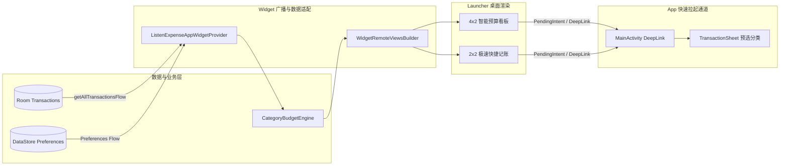

# 桌面小部件体验 2.0 设计与实现规范 (App Widget 2.0 Specification)

## 1. 概述 (Overview)

### 1.1 背景与痛点
目前用户记账必须解锁手机、查找 App 图标、点击打开主界面、点击记账按钮、选择分类、输入金额，全流程通常耗时 5~10 秒。当在超市、地铁闸机、餐厅等碎片化即时消费场景下，过长的记账路径容易导致用户放弃记账。

### 1.2 核心目标
1. **2 秒闪电快捷记账**：在桌面小组件直接提供高频分类图标（🍔 餐饮、🚗 交通、🛍️ 购物、📦 杂项），轻触一键拉起记账弹窗并预选分类与默认账户。
2. **4x2 / 2x2 智能双模看板**：实时呈现本月总支出、剩余预算额度、收支进度与三态健康度（正常/预警/超支）。
3. **响应式数据联动与 Material You 动态适配**：数据变更时毫秒级自动更新，自适应系统深浅色与动态主题。

---

## 2. 架构与通信机制 (Architecture & Data Flow)



---

## 3. 小组件规格与交互设计 (Widget Layout & Interaction)

### 3.1 4x2 智能预算看板 (Smart Budget & Quick Actions Widget)
* **左侧：收支与预算健康仪表**：
  * 当月总支出（如 `￥3,540.00`）与剩余可用预算（如 `剩余 ￥1,460.00`）。
  * 线性进度条（根据预算健康度动态变色：`<80%` 主题色/绿色、`80%~100%` 琥珀色预警、`≥100%` 红色超支告警）。
* **右侧：4 大高频闪电分类记账按钮**：
  * 4 个圆形彩色分类快捷入口：
    1. 🍔 **餐饮** (`cat_food`)
    2. 🚗 **交通** (`cat_transport`)
    3. 🛍️ **购物** (`cat_shopping`)
    4. 📦 **日用** (`cat_daily`)
  * 底部提供 `+ 记一笔` 通用入口。

### 3.2 2x2 紧凑极速记账小组件 (Compact Quick Entry Widget)
* 针对桌面空间有限的用户，聚合 4 个快捷分类九宫格图标与当月结余简报。

---

## 4. DeepLink 与 PendingIntent 路由实现 (DeepLink Routing)

### 4.1 PendingIntent 参数构造
小组件中为每个快捷分类按钮绑定专属 `PendingIntent`：
```kotlin
fun createCategoryQuickActionIntent(context: Context, categoryId: String, type: String = "EXPENSE"): PendingIntent {
    val intent = Intent(context, MainActivity::class.java).apply {
        action = Intent.ACTION_VIEW
        data = Uri.parse("lexpense://quick_add?category=$categoryId&type=$type")
        flags = Intent.FLAG_ACTIVITY_NEW_TASK or Intent.FLAG_ACTIVITY_CLEAR_TOP
    }
    return PendingIntent.getActivity(
        context,
        categoryId.hashCode(),
        intent,
        PendingIntent.FLAG_UPDATE_CURRENT or PendingIntent.FLAG_IMMUTABLE
    )
}
```

### 4.2 MainActivity / ExpenseAppState 意图解析
```kotlin
LaunchedEffect(intentUri) {
    intentUri?.let { uri ->
        if (uri.scheme == "lexpense" && uri.host == "quick_add") {
            val categoryId = uri.getQueryParameter("category") ?: "cat_food"
            val type = uri.getQueryParameter("type") ?: "EXPENSE"
            viewModel.handleIntent(TransactionsIntent.OpenQuickAdd(categoryId, type))
        }
    }
}
```

---

## 5. 性能与能耗优化 (Performance & Battery Guards)

1. **变动驱动刷新（Zero-Polling）**：彻底摒弃周期性后台轮询定时器（`updatePeriodMillis = 0`），仅在本地数据库 `TransactionDao` 写入/修改/删除或偏好设置变更时，由 Flow 收集器触发 `AppWidgetManager.updateAppWidget`。
2. **前台即时同步与冷启动补偿**：在 `MainActivity.onResume()` 时触发一次轻量刷新，保证极端清理进程后桌面数据与 App 内完全一致。

---

## 6. 落地实现与工程文件映射 (Implementation Status & File Mapping)

本规范已在代码库中 100% 完整落地与测试验证，核心落地代码映射如下：

| 模块 / 职责 | 对应实现文件 | 说明 |
| :--- | :--- | :--- |
| **小部件布局** | [`widget_expense_overview.xml`](../app/src/main/res/layout/widget_expense_overview.xml) | 4x2 智能双模看板，包含左侧收支仪表盘与右侧分类记账矩阵 |
| **配置元数据** | [`listen_expense_widget_info.xml`](../app/src/main/res/xml/listen_expense_widget_info.xml) | `updatePeriodMillis="0"`, 4x2 单元格尺寸与无轮询设定 |
| **Provider 调度** | [`ListenExpenseAppWidgetProvider.kt`](../app/src/main/java/com/listen/expensetracker/widget/ListenExpenseAppWidgetProvider.kt) | 负责月度核算、健康度判定与 RemoteViews 绑定 |
| **深浅色主题** | [`colors_widget.xml`](../app/src/main/res/values/colors_widget.xml) & [`values-night`](../app/src/main/res/values-night/colors_widget.xml) | RemoteViews 规范原生深浅色自适应调色盘 |
| **DeepLink 与路由** | [`MainActivity.kt`](../app/src/main/java/com/listen/expensetracker/MainActivity.kt) & [`AndroidManifest.xml`](../app/src/main/AndroidManifest.xml) | singleTop 模式接收 `lexpense://quick_add`，别名规范化映射 |
| **全局快速记账** | [`ExpenseAppState.kt`](../app/src/main/java/com/listen/expensetracker/core/state/ExpenseAppState.kt) | `openQuickAdd` 调度与跨 Tab 自动切换 |
| **记账分类预选** | [`TransactionSheet.kt`](../app/src/main/java/com/listen/expensetracker/features/transactions/components/TransactionSheet.kt) | 支持 `initialCategoryId` 自动预选分类与收支类型 |
| **自动化测试** | [`ListenExpenseAppWidgetProviderTest.kt`](../app/src/test/java/com/listen/expensetracker/widget/ListenExpenseAppWidgetProviderTest.kt) | 月度核算、健康度判定与路由别名测试 (100% Pass) |

