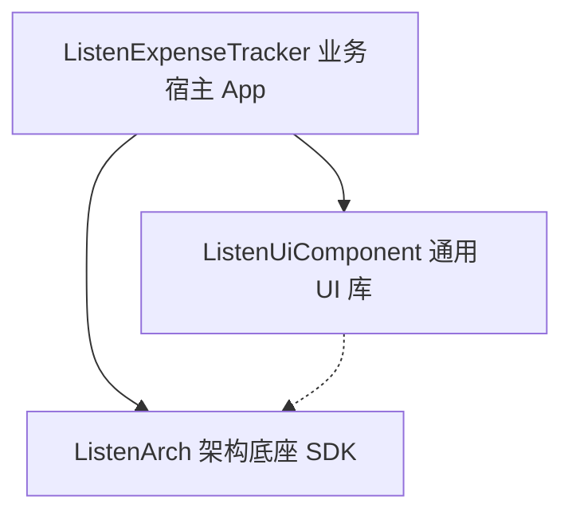
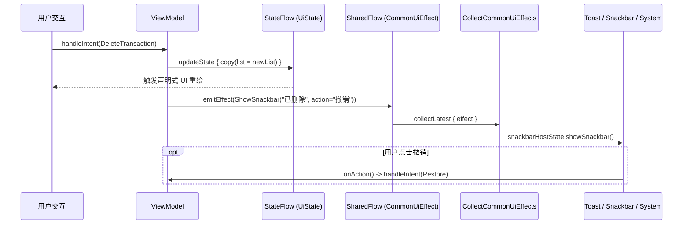
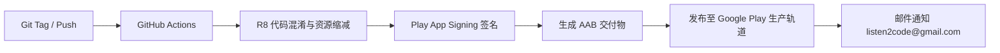

# ListenExpenseTracker - 系统架构设计文档 (System Architecture)

本文档系统性阐述 **ListenExpenseTracker** 的整体架构设计、分层规范、核心设计模式与技术演进方案。

> 每个模块均附带 **设计思路 (Design Rationale)**、**实现要点 (Implementation Details)** 与 **关键代码解读 (Code Walkthrough)** 说明。

---

## 1. 架构总览与分层拓扑

项目严格遵循 **Local-First (本地优先)、Privacy-First (隐私优先)、Serverless (无服务器)** 的架构设计，采用清晰的三层依赖拓扑：



### 1.1 模块职责划分

| 模块名称 | 职责定位 | 包含的核心内容 | 依赖与边界约束 |
| :--- | :--- | :--- | :--- |
| **`ListenArch`** | 底层架构技术底座 | MVI `BaseViewModel` 状态机、APM 内存日志、`TraceManager` 链路打点、`CrashHandler` 崩溃捕获、`BaseDataStoreManager`、`CommonUiEffect`、`StringsRes` 调度引擎 | **零业务耦合**。严禁包含任何特定业务实体、数据表或业务文案。 |
| **`ListenUiComponent`** | 通用视觉与交互 UIKit | `DonutChart` / `BarChart` / `LineChart` 通用图表、`NumericKeypad` 通用数字键盘、`SurfaceCard`、`SearchBarInput`、`SegmentedProgressBar`、`BaseScreenScaffold`、`LogInspectorSheet` | **纯视觉组件库**。严禁包含任何业务领域模型或写死业务逻辑。 |
| **`ListenExpenseTracker`** | 业务宿主 App | `TransactionEntity` / `TransactionDao` / `AppDatabase`、`ExpenseDataStoreManager`、`ExpenseStrings` 业务字典、`TransactionCalculationEngine`、流水/统计/设置 Feature 页面 | 承载记账业务的全部领域逻辑、交互编排与持久化。 |

#### 🔑 三层隔离的核心原则

> **依赖方向单一向下**：`ListenExpenseTracker` → `ListenUiComponent` → `ListenArch`，严禁逆向引用。这意味着 `ListenArch` 中的 `BaseViewModel` 完全不知道 `TransactionEntity` 的存在，`ListenUiComponent` 中的 `DonutChart` 完全不知道"分类"的概念。这种隔离使得 `ListenArch` 和 `ListenUiComponent` 可以被任何其他 Listen 系列 App 复用。

---

## 2. 核心设计模式与架构实践

### 2.1 泛型路由与生命周期适配 (`CommonRoute`)

#### 🔑 设计思路

`CommonRoute` 是全工程**唯一的生命周期-MVI 适配器**：它将 Android 系统生命周期事件（`ON_RESUME`/`ON_PAUSE`）和 Compose 组合生命周期（挂载/卸载）统一转换为 MVI `LifecycleEvent`，派发给 ViewModel 的 `dispatchLifecycleEvent()`。

> 没有 `CommonRoute`，每个页面都需要手动写 `DisposableEffect` + `LifecycleEventObserver` 样板代码。

#### 💡 关键代码解读

```kotlin
// ---- 为什么声明为 inline + reified VM？ ----
// inline：消除 Lambda 对象分配开销（CommonRoute 在每个页面都被调用）
// reified VM：允许 viewModel() 默认参数在编译期解析正确的 ViewModel 类型
// crossinline content：阻止 Lambda 内部 non-local return，确保生命周期回调稳定
@Composable
inline fun <S : Any, I : Any, reified VM : BaseViewModel<S, I>> CommonRoute(
    viewModel: VM = viewModel(),
    crossinline content: @Composable (state: S, onIntent: (I) -> Unit) -> Unit
) {
    val lifecycleOwner = LocalLifecycleOwner.current

    // ---- 双重生命周期覆盖 ----
    // 1. DisposableEffect 的 onDispose：覆盖 Compose 重组（如 Tab 切换）
    // 2. LifecycleEventObserver：覆盖系统生命周期（如屏幕旋转、切后台）
    // 两者结合确保 ViewModel 在任何场景下都能感知页面可见性变化
    DisposableEffect(lifecycleOwner, viewModel) {
        val observer = LifecycleEventObserver { _, event ->
            when (event) {
                Lifecycle.Event.ON_RESUME -> viewModel.dispatchLifecycleEvent(ON_APPEAR)
                Lifecycle.Event.ON_PAUSE  -> viewModel.dispatchLifecycleEvent(ON_DISAPPEAR)
                else -> Unit
            }
        }
        lifecycleOwner.lifecycle.addObserver(observer)
        viewModel.dispatchLifecycleEvent(ON_APPEAR)  // 首次挂载立即触发

        onDispose {
            lifecycleOwner.lifecycle.removeObserver(observer)
            viewModel.dispatchLifecycleEvent(ON_DISAPPEAR)  // Tab 切走时触发
        }
    }

    // ---- 单向数据流绑定 ----
    val state by viewModel.viewState.collectAsState()
    content(state, viewModel::handleIntent)  // 将状态 + Intent 回调注入无状态 Screen
}
```

---

### 2.2 分离式状态代理 (`StateHolder` & `Delegate` Pattern)

#### 🔑 设计思路

Google 官方推荐的**关注点分离 (Separation of Concerns)** 三层模式：

| 角色 | 示例 | 职责 | 生命周期 |
|------|------|------|---------|
| **ViewModel** | `SettingsViewModel` | 业务数据（语言、主题、预算） | 跨 Configuration Change 存活 |
| **StateHolder** | `SettingsStateHolder` | Compose 框架状态（滚动位置、`ActivityResultLauncher`） | 与 Composable 树绑定 |
| **Delegate** | `SettingsSyncDelegate` | 特定子领域复杂逻辑（云同步、Excel 导出） | 通过 DI 注入，可独立测试 |

```kotlin
// ---- 为什么 ActivityResultLauncher 不能放在 ViewModel 中？ ----
// ActivityResultLauncher 必须在 @Composable 作用域内通过
// rememberLauncherForActivityResult() 注册，与 Activity 生命周期绑定。
// 如果在 ViewModel 中注册，屏幕旋转后回调会丢失。
// 因此需要 StateHolder 这个中间层来持有框架级状态。
```

---

### 2.3 全类型安全应用状态体系 (`ExpenseAppState`)

#### 🔑 设计思路

`ExpenseAppState` 是整个应用的**指挥官 (Conductor)**，它不是 ViewModel，而是一个轻量级状态编排器。它：

1. **持有** 3 个 Feature ViewModel + `SnackbarHostState`
2. **协调** Tab 切换时的时间视角同步
3. **调度** 全局浮层（APM Inspector）和快捷记账路由

#### 💡 关键代码解读 — 跨 Tab 时间同步 (`syncTimeState`)

```kotlin
// ---- 这是架构中最复杂的状态协调逻辑 ----
// 场景：用户在"流水"Tab 看 8 月数据，切到"统计"Tab，统计也应自动切到 8 月。
// 反之亦然。但 Settings Tab 是"中立"的，不参与时间同步。

private var lastTimeTab: NavTab = NavTab.TRANSACTIONS
// ↑ 追踪"上一个非 Settings Tab"，因为从 Settings 切到 Statistics 时，
// 应该从 Transactions（而非 Settings）同步时间。

private var preserveStatisticsYearOnReturn = false
// ↑ 下钻保护标志：当用户从"统计-年视图"点击某月下钻到"流水-月视图"时，
// 必须保护统计页面的年视图不被覆盖。否则用户返回统计页时会发现年视图消失了。

private fun syncTimeState(fromTab: NavTab, toTab: NavTab) {
    if (fromTab == TRANSACTIONS && toTab == STATISTICS) {
        val stats = statisticsViewModel.viewState.value
        val tx = transactionsViewModel.viewState.value

        // ---- 下钻保护拦截 ----
        // 如果统计页处于年视图，且是从下钻返回，则跳过同步
        if (preserveStatisticsYearOnReturn
            && stats.period == StatisticsPeriod.YEAR
            && tx.period == TransactionPeriod.MONTH) {
            preserveStatisticsYearOnReturn = false
            return  // 不同步！保护年视图
        }

        // 正常同步：将流水页的周期和偏移量同步到统计页
        val targetPeriod = if (tx.period == TransactionPeriod.YEAR)
            StatisticsPeriod.YEAR else StatisticsPeriod.MONTH
        if (stats.period != targetPeriod)
            statisticsViewModel.handleIntent(ChangePeriod(targetPeriod))
        if (targetPeriod == MONTH && stats.selectedMonthOffset != tx.selectedMonthOffset)
            statisticsViewModel.handleIntent(SetMonthOffset(tx.selectedMonthOffset))
    }
    // ... 反向同步逻辑类似
}

fun switchTab(tab: NavTab) {
    if (tab != currentTab) {
        // Settings 是中立 Tab，切换时用 lastTimeTab 作为源
        val sourceTab = if (currentTab == NavTab.SETTINGS) lastTimeTab else currentTab
        syncTimeState(fromTab = sourceTab, toTab = tab)
        if (tab != NavTab.SETTINGS) lastTimeTab = tab  // 只更新非 Settings
        currentTab = tab
    }
}
```

#### 📋 导航方法矩阵

| 方法 | 触发场景 | 设置 `preserveStatisticsYearOnReturn` |
|------|---------|--------------------------------------|
| `navigateToTransactionsCategory` | 统计页点击分类饼图下钻 | `false` |
| `navigateToTransactionsDate` | 统计页点击日期折线图下钻 | `false` |
| `navigateToTransactionsMonth` | 统计页年度总览点击某月下钻 | **`true`** ← 唯一置位点 |
| `navigateToBudgetAdjustment` | 洞察卡片"调整预算"点击 | `false` |
| `openQuickAdd` | Widget 闪电记账 / FAB | 不涉及 |

#### 📋 双击 Tab 智能归位

```kotlin
// SharedFlow(replay=0, extraBufferCapacity=1)：
// - replay=0：新订阅者不会收到历史事件（避免重复滚动）
// - extraBufferCapacity=1：tryEmit 不会挂起（即使没有订阅者也不阻塞）
private val _scrollToTopEvents = MutableSharedFlow<NavTab>(replay = 0, extraBufferCapacity = 1)

fun triggerScrollToTop(tab: NavTab) {
    _scrollToTopEvents.tryEmit(tab)  // 通知 UI 层滚动到顶部
    // 同时发送 ScrollToTop Intent，让 ViewModel 自行决定是否重置偏移量到当月/当年
    when (tab) {
        NavTab.TRANSACTIONS -> transactionsViewModel.handleIntent(ScrollToTop)
        NavTab.STATISTICS   -> statisticsViewModel.handleIntent(ScrollToTop)
        NavTab.SETTINGS     -> settingsViewModel.handleIntent(ScrollToTop)
    }
}
```

---

### 2.4 两级宿主体系 (Two-Tier Host Architecture)

```
顶层容器 (ListenTheme -> Surface)
  ├── 业务框架层: ListenExpenseTrackerApp
  │     ├── TransactionsScreen ──> TransactionsDialogHost (页面级弹窗宿主)
  │     ├── StatisticsScreen   ──> StatisticsDialogHost   (页面级弹窗宿主)
  │     └── SettingsScreen     ──> SettingsDialogHost     (页面级弹窗宿主)
  ├── 全局浮层层: AppOverlayHost (全局宿主: APM 日志抽屉、全局悬浮球)
  └── 安全遮罩层: BiometricLockOverlay (最高 Z-Index，认证前不可穿透)
```

#### 🔑 页面级弹窗宿主

```kotlin
// 弹窗显隐由 UiState.activeDialog 密封接口驱动：
sealed interface TransactionsDialog {
    data class AddTransaction(val initialCategoryId: String?) : TransactionsDialog
    data class EditTransaction(val transaction: TransactionEntity) : TransactionsDialog
    data object MonthlyBudget : TransactionsDialog
    // ...
}
// 页面末尾一行声明式调用：
TransactionsDialogHost(state, onIntent)  // 统一分发，Screen 代码 ≤ 150 行
```

#### 🔑 全局浮层宿主 (`AppOverlayHost`)

```kotlin
@Composable
fun AppOverlayHost(appState: ExpenseAppState) {
    val settingsState by appState.settingsViewModel.viewState.collectAsState()
    // APM 悬浮窗由设置页持久化开关驱动，与 ExpenseAppState.activeOverlay 独立
    // 这样即使切换 Tab、打开弹窗，悬浮窗始终常驻
    if (settingsState.apmFloatingWindowEnabled) {
        ApmFloatingOverlay(lang = settingsState.language)
    }
}
```

---

### 2.5 集中副作用流 (`CollectCommonUiEffects`)

#### 🔑 设计思路

传统做法是在每个 Screen 中写 `LaunchedEffect { vm.viewEffect.collect { ... } }`，但多个 ViewModel 会导致大量重复样板代码。`CollectCommonUiEffects` 将**所有 ViewModel 的通用副作用**收拢到 `MainActivity` 的单一注册点。



#### 💡 关键代码解读

```kotlin
@Composable
fun CollectCommonUiEffects(
    vararg viewModels: BaseViewModel<*, *>,  // 接收全部 ViewModel
    snackbarHostState: SnackbarHostState,
    // ...
) {
    viewModels.forEach { vm ->
        // ---- 每个 ViewModel 独立协程 ----
        // keyed by vm: 当 ViewModel 实例不变时，协程不会重启
        LaunchedEffect(vm) {
            // collectLatest：如果新 Effect 到来时上一个还在处理（如 Snackbar 正在展示），
            // 会取消上一个，保证最新的 Effect 优先展示
            vm.viewEffect.collectLatest { effect ->
                when (effect) {
                    is ShowToast    -> Toast.makeText(context, effect.message, SHORT).show()
                    is ShowSnackbar -> {
                        val res = snackbarHostState.showSnackbar(effect.message, effect.actionLabel)
                        if (res == ActionPerformed) effect.onAction?.invoke()
                    }
                    is ShareText    -> shareSystemText(context, effect.content, effect.title)
                    is OpenUrl      -> openBrowserUrl(context, effect.url)  // try-catch 防无浏览器崩溃
                    is HideKeyboard -> keyboardController?.hide()
                    else -> {}  // 业务专属 Effect（ScrollToTop 等）由各 Screen 独立消费
                }
            }
        }
    }
}
```

---

### 2.6 统一记账弹窗与状态提升 (Unified Transaction Sheet)

系统中记账最核心的入口采用了统一的 `TransactionSheet` 架构设计。
- **设计亮点**：将"新增 (Add)"与"编辑 (Edit)"逻辑合并入同一个组件中，通过可选的 `transaction: TransactionEntity?` 参数区分。显著减少了代码重复（DRY 原则）。
- **技术难点与解决方案**：
  - **状态重置异常**：在不同账单之间快速点击编辑时，弹窗可能会残留上一个账单的数据。通过 `remember(transaction)` / `remember(initialTimestamp)` 巧妙触发局部状态重组，确保数据精准初始化。
  - **收支分类动态过滤**：利用 `remember(type, categoryVersion)` 实现收支类型切换或新增分类时的列表实时过滤，避免了复杂的回调传参。
- **状态提升 (State Hoisting)**：弹窗内部所有的输入字段（金额、备注、类型、分类等）均为本地 `mutableStateOf` 状态，只在用户点击"完成"时才打包为完整的 `TransactionEntity` 通过回调向上传递，使外部父组件彻底屏蔽了零碎的输入过程。

---

### 2.7 组件拆分与规范基线 (`PROMPTS.md`)

UI 组件严格遵循 `PROMPTS.md` 规范落地：
- **单文件规模**：单个 UI 文件严格限制在 **200 ~ 250 行以内**，复杂弹窗/卡片拆分至 `features/**/components/` 独立文件。
- **参数签名规范 (Rule 13)**：所有独立 Composable 组件首个可选参数统一为 `modifier: Modifier = Modifier`。
- **高危操作标准 (Rule 15)**：删除类二次确认统一采用 `CommonButtonStyle.Danger` 红色危险确认按钮。
- **零硬编码 (Rule 5)**：所有展示文案通过 `AppStrings` + `StringsRes.get()` / `ExpenseStrings` 动态解析。

---

## 3. 本地存储与计算架构 (Local-First Engine)

1. **Room SQLite**：`TransactionEntity` 存储全部单笔账单流水，`RecurringRuleEntity` 存储周期规则，通过 `Dao` 提供响应式 Flow 监听；
2. **DataStore Preferences**：`ExpenseDataStoreManager` 承载用户个性化偏好（语言、主题、主色调、月预算、币种符号、自定义账户列表 JSON）；
3. **高阶纯计算引擎 (Engines)**：
   - `TransactionCalculationEngine`：纯 Kotlin 无状态计算引擎，负责多维过滤管线（5 层）、收支聚合、分类预算消耗比率测算。
   - `FinancialInsightEngine`：智能诊断引擎，10 大规则策略（月环比 >±12%、分类占比 ≥45%、消耗速率预测等）。
   - `RecurringTransactionEngine`：后台周期调度与履约引擎，处理按日/周/月/年自动复用记账逻辑。
   
---

## 4. Google 身份鉴权与 Google Drive 云同步架构

系统采用 **Google Identity + Google Drive REST API v3** 无服务器直连方案：
1. **认证层 (`GoogleAuthManager`)**：基于 Android 官方最新的 `androidx.credentials.CredentialManager`，通过 Web Client ID 获得安全的 ID Token 与用户信息，账号状态经由 `DataStore` 安全持久化；
2. **存储层 (`GoogleDriveService`)**：基于轻量级 HTTP 请求调用 Google Drive REST API v3，在用户个人 Google 云盘根目录下通过 `multipart/related` 自动维护加密备份文件 `lexpense_backup.json`；
3. **动态提权机制**：拦截 `UserRecoverableAuthException` 并自动调起 Google 原生授权面板，获得用户明确同意后无缝执行多端云备份与快照恢复；
4. **架构详述**：参见专属文档 [Google 登录与 Drive 同步全指南](google_auth_and_drive_sync_guide.md)。

---

## 5. 生物识别与资产安全防窥 (Security & Privacy)

#### 🔑 设计思路

安全体系采用**三层防御架构**：

```
┌─────────────────────────────────────────┐
│  BiometricLockOverlay (最高 Z-Index)     │ ← 全屏遮罩层，认证前不可穿透
├─────────────────────────────────────────┤
│  AppSecurityCoordinator (生命周期协调器)  │ ← 管理锁定状态机 + FLAG_SECURE
├─────────────────────────────────────────┤
│  BiometricSecurityManager (能力检测)      │ ← 调用系统 BiometricPrompt
└─────────────────────────────────────────┘
```

#### 💡 关键代码解读

```kotlin
class AppSecurityCoordinator(private val onShakeTriggered: () -> Unit) {
    var isAppLocked by mutableStateOf(false)  // Compose 观察此值决定是否显示遮罩

    // ---- 为什么用 SystemClock.elapsedRealtime() 而非 System.currentTimeMillis()？ ----
    // elapsedRealtime() 是单调递增时钟，不受用户手动调整系统时间的影响。
    // 如果用 currentTimeMillis()，用户可以把时间往回调来绕过超时锁定。
    private var backgroundTimestamp = 0L

    fun onStop() {
        backgroundTimestamp = SystemClock.elapsedRealtime()  // 记录切后台时刻
    }

    fun onStart(activity, biometricEnabled, isBioSupported, timeoutSeconds, ...) {
        if (biometricEnabled && isBioSupported) {
            val elapsedSeconds = if (backgroundTimestamp == 0L) {
                Long.MAX_VALUE / 1000  // 首次启动：强制触发锁定
            } else {
                (SystemClock.elapsedRealtime() - backgroundTimestamp) / 1000
            }
            if (elapsedSeconds >= timeoutSeconds) {
                isAppLocked = true  // 超时 → 锁定
                promptUnlock(activity, lang, recentAppsShield)
            }
        }
    }

    // ---- FLAG_SECURE：多任务界面防窥 ----
    // Android 系统在用户上滑进入多任务界面时，会对当前窗口截取快照。
    // FLAG_SECURE 阻止系统截取快照，多任务卡片显示为空白或模糊。
    fun applyRecentAppsShield(activity, recentAppsShield: Boolean) {
        if (recentAppsShield || isAppLocked) {
            activity.window.setFlags(FLAG_SECURE, FLAG_SECURE)
        } else {
            activity.window.clearFlags(FLAG_SECURE)
        }
    }
}
```

```kotlin
// BiometricSecurityManager：无状态工具单例
object BiometricSecurityManager {
    fun isBiometricOrCredentialAvailable(context: Context): Boolean {
        // BIOMETRIC_STRONG or DEVICE_CREDENTIAL：
        // 优先使用指纹/面容等强生物识别，fallback 到 PIN/图案/密码
        val authenticators = BIOMETRIC_STRONG or DEVICE_CREDENTIAL
        return biometricManager.canAuthenticate(authenticators) == BIOMETRIC_SUCCESS
    }
    // promptUnlock 要求 FragmentActivity（而非 Context），
    // 因为 BiometricPrompt 需要 Fragment 生命周期来管理系统弹窗
}
```

---

## 6. 触觉反馈与平滑动效设计系统 (Haptics & Motion)

1. **分级触觉系统 (LocalHapticFeedback)**：
   - **高频操作 (Tap)**：`NumericKeypad` 按键、头部账户筛选 Chip 切换、排序规则选择采用 `TextHandleMove`，提供物理键盘般的清脆反馈；
   - **关键提交 (Confirm)**：「完成记账 ✓」全宽按钮按压、`AccountDeleteConfirmDialog` 危险删除采用 `LongPress` 脉冲，确认状态流转。
2. **渐进式插值动效 (Progressive Motion)**：
   - **图表展开**：`DonutChart`（650ms 顺时针扫开）、`LineChart`（600ms 自底向上拔起），采用 `FastOutSlowInEasing` 阻尼曲线；
   - **跨屏/状态过渡**：`StatisticsContentList` 采用 `AnimatedContent` 承载收支 Tab 交叉淡入淡出（Crossfade 300ms），预算进度条接入 500ms 动态插值，彻底消除生硬跳帧。

---

## 7. CI/CD 自动化构建与 Release Pipeline 发布体系



1. **工业级版本管理**：`versionCode` 随构建自动化递增，`versionName` 遵循 SemVer 标准；
2. **产物安全性与极简化**：强制开启 `minifyEnabled` + `shrinkResources`，Secrets 凭据由 GitHub Actions Secrets 隔离；
3. **发布成功精准通知**：工作流配置 `if: success()`，仅在成功发版至 Google Play 时发送推送邮件。

---

## 8. Widget 2.0 与系统桌面触达 (App Widget)

**Widget 2.0** 架构在无需主应用长驻后台的前提下，实现了"看板展示 + 闪电唤起"的双核心价值。
1. **5x2 智能卡片布局**：采用 `WidgetLayoutBinder` 渲染包含当月结余、预算进度条、健康度徽章。
2. **动态渲染与主题适配**：使用 Android 标准的 `RemoteViews` 进行渲染，自动跟随系统深色/浅色模式切换 (`values-night`)。
3. **极速唤醒路由 (DeepLink Intents)**：提供针对餐饮、交通等高频类别的直达 `PendingIntent`，实现从桌面到记账弹窗的 0 级路径。
4. **架构详述**：参见专属文档 [桌面小部件 2.0 设计规范](app_widget_2_0_design.md)。

---

## 9. 核心架构源码文件清单

| 文件 | 行数 | 核心职责 |
|------|------|---------|
| `ExpenseAppState.kt` | 236 行 | 应用全局状态编排、跨 Tab 时间同步、导航调度 |
| `CommonRoute.kt` | 54 行 | 泛型 MVI 路由、生命周期自动适配 |
| `CommonUiEffectCollector.kt` | 104 行 | 全局集中副作用流收集 |
| `AppSecurityCoordinator.kt` | 127 行 | 安全生命周期协调、FLAG_SECURE、锁定状态机 |
| `BiometricSecurityManager.kt` | 80 行 | 设备生物识别能力检测、解锁弹窗调度 |
| `AppOverlayHost.kt` | 26 行 | 全局浮层容器（APM 悬浮窗常驻） |

---

## 10. 技术难点总结

| # | 难点 | 解决方案 | 相关代码 |
|---|------|---------|---------|
| 1 | Tab 切换时月/年偏移量不同步 | `syncTimeState()` 双向同步 + `preserveStatisticsYearOnReturn` 下钻保护 | `ExpenseAppState` |
| 2 | Settings Tab 不应参与时间同步 | `lastTimeTab` 追踪上一个非 Settings Tab | `ExpenseAppState.switchTab()` |
| 3 | 每个页面都需要手动写生命周期样板代码 | `CommonRoute` 泛型路由统一适配 | `CommonRoute.kt` |
| 4 | 多 ViewModel 的 Toast/Snackbar 重复注册 | `CollectCommonUiEffects(vararg)` 单注册点 | `CommonUiEffectCollector.kt` |
| 5 | 安全超时可被手动调系统时钟绕过 | `SystemClock.elapsedRealtime()` 单调时钟 | `AppSecurityCoordinator` |
| 6 | 多任务界面泄露敏感数据 | `FLAG_SECURE` 阻止系统截取 Task Snapshot | `applyRecentAppsShield()` |
| 7 | ActivityResultLauncher 不能放 ViewModel | StateHolder 模式分离框架级状态 | `SettingsStateHolder.kt` |
| 8 | SharedFlow replay 导致重复滚动 | `replay=0, extraBufferCapacity=1` | `scrollToTopEvents` |

