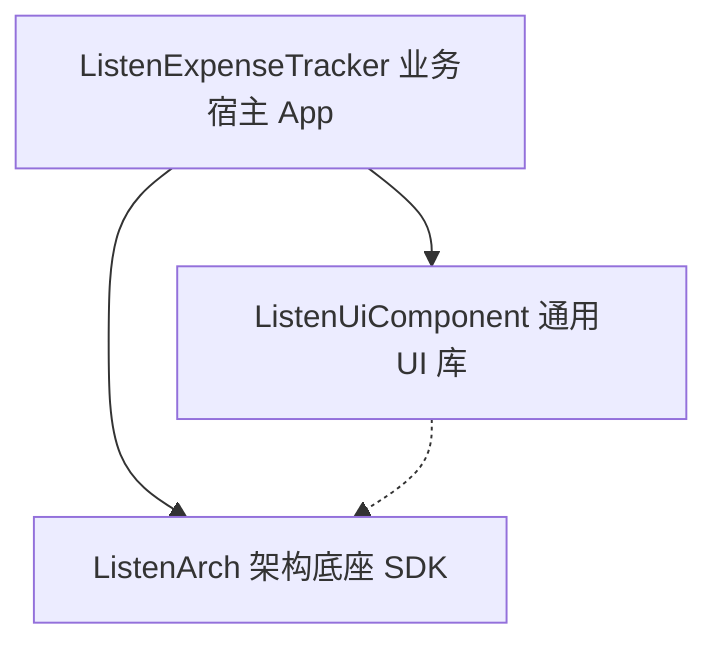
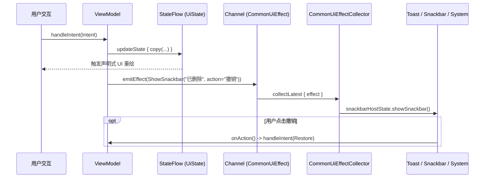

# ListenExpenseTracker - 系统架构设计文档 (System Architecture)

本文档系统性阐述 **ListenExpenseTracker** 的整体架构设计、分层规范、核心设计模式与技术演进方案。

---

## 1. 架构总览与分层拓扑

项目严格遵循 **Local-First (本地优先)、Privacy-First (隐私优先)、Serverless (无服务器)** 的架构设计，采用清晰的三层依赖拓扑：



### 1.1 模块职责划分

| 模块名称 | 职责定位 | 包含的核心内容 | 依赖与边界约束 |
| :--- | :--- | :--- | :--- |
| **`ListenArch`** | 底层架构技术底座 | MVI `BaseViewModel` 状态机、APM 内存日志、`TraceManager` 链路打点、`CrashHandler` 崩溃捕获、`BaseDataStoreManager`、`CommonUiEffect`、`StringsRes` 调度引擎 | **零业务耦合**。严禁包含任何特定业务实体、数据表或业务文案。 |
| **`ListenUiComponent`** | 通用视觉与交互 UIKit | `DonutChart` / `BarChart` / `LineChart` 通用图表、`NumericKeypad` 通用数字键盘、`SurfaceCard`、`SearchBarInput`、`SegmentedProgressBar`、`BaseScreenScaffold`、`LogInspectorSheet` | **纯视觉组件库**。严禁包含任何业务领域模型或写死业务逻辑。 |
| **`ListenExpenseTracker`** | 业务宿主 App | `TransactionEntity` / `TransactionDao` / `AppDatabase`、`ExpenseDataStoreManager`、`ExpenseStrings` 业务字典、`TransactionCalculationEngine`、流水/统计/设置 Feature 页面 | 承载记账业务的全部领域逻辑、交互编排与持久化。 |

---

## 2. 核心设计模式与架构实践

### 2.1 泛型路由与状态提升 (`CommonRoute` Pattern)

为了彻底消除为每个页面编写样板式 `XxxRoute` 的负担，采用泛型路由组件统一状态订阅与意图分发：

```kotlin
@Composable
inline fun <S : Any, I : Any, reified VM : BaseViewModel<S, I, *>> CommonRoute(
    viewModel: VM = viewModel(),
    crossinline content: @Composable (state: S, onIntent: (I) -> Unit) -> Unit
) {
    val state by viewModel.viewState.collectAsState()
    content(state, viewModel::handleIntent)
}
```

- **`CommonRoute`**：统一负责从 ViewModel 订阅不可变 State，并将 `handleIntent` 方法引用传递给子组件；
- **`FeatureScreen` (Stateless 纯视图)**：每个页面只需编写纯 Stateless Composable，只接收不可变 `State` 与 `onIntent: (Intent) -> Unit`，保证 100% 纯函数化，极大简化 UI 预览（`@Preview`）与单元测试。

---

### 2.2 两级宿主体系 (Two-Tier Host Architecture)

为了杜绝在 Composable 中随处散落 `mutableStateOf` 标志位与 `if (showXxx)` 条件渲染，整个 App 建立了清晰的**两级宿主体系**：

```
顶层容器 (ListenTheme -> Surface)
  ├── 业务框架层: ListenExpenseTrackerApp
  │     ├── TransactionsScreen ──> TransactionsDialogHost (页面级弹窗宿主)
  │     ├── StatisticsScreen   ──> StatisticsDialogHost   (页面级弹窗宿主)
  │     └── SettingsScreen     ──> SettingsDialogHost     (页面级弹窗宿主)
  └── 全局浮层层: AppOverlayHost (全局宿主: APM 日志抽屉、全局悬浮球、全局 HUD)
```

1. **页面级弹窗宿主 (`FeatureDialogHost`)**：
   - 弹窗显隐由 `UiState.activeDialog` 密封接口（Sealed Interface）驱动；
   - 页面主 Composable 只负责可见视图布局，末尾声明式调用 `FeatureDialogHost(state, onIntent)` 统一分发；
   - 彻底将 Screen 代码行数精简在 150 行以内。

2. **全局浮层宿主 (`AppOverlayHost`)**：
   - 由 `ExpenseAppState.activeOverlay` 统一驱动；
   - 挂载在 `Surface` 根节点的最外层，享有天然**最高 Z-Index**；
   - 业务页面重组与滚动不影响全局浮层，为未来演进为**全局悬浮球/可拖拽悬浮窗**提供底层支撑。

---

### 2.3 集中副作用流 (`CommonUiEffectCollector`)

所有 ViewModel 统一继承通用单次副作用 `CommonUiEffect`：



- **零样板代码**：在 `MainActivity` 中仅需一行 `CollectCommonUiEffects(appState.vm1, appState.vm2, ...)` 即可监听全 App 的 Toast、带 Action 回调的 Snackbar、系统分享以及 APM 开启事件。

---

### 2.4 全类型安全应用状态体系 (`ExpenseAppState`)

将整个应用的顶层生命周期与导航状态收口至 `ExpenseAppState`：
- **`NavTab` 枚举**：定义 `TRANSACTIONS`, `STATISTICS`, `SETTINGS`，彻底消灭 `0, 1, 2` 等魔数索引；
- **状态持有**：集中管理各个 ViewModel 实例与 `SnackbarHostState`，使 `MainActivity` 保持在 100 行左右的极致精简状态。

---

## 3. 本地存储与计算架构 (Local-First Engine)

1. **Room SQLite**：`TransactionEntity` 存储全部单笔账单流水，`TransactionDao` 提供响应式 Flow 监听；
2. **DataStore Preferences**：`ExpenseDataStoreManager` 承载用户个性化偏好（语言、主题、主色调、月预算、币种符号）；
3. **TransactionCalculationEngine**：纯 Kotlin 高性能数据计算引擎，负责内存多维过滤（按月份、账户、搜索关键字）、收支聚合、预算消耗比率测算，与 UI 完全解耦。

---

## 4. Google 身份鉴权与 Google Drive 云同步架构

系统采用 **Google Identity + Google Drive REST API v3** 无服务器直连方案：
1. **认证层 (`GoogleAuthManager`)**：基于 Android 官方最新的 `androidx.credentials.CredentialManager`，通过 Web Client ID 获得安全的 ID Token 与用户信息，账号状态经由 `DataStore` 安全持久化；
2. **存储层 (`GoogleDriveService`)**：基于轻量级 HTTP 请求调用 Google Drive REST API v3，在用户个人 Google 云盘根目录下通过 `multipart/related` 自动维护加密备份文件 `lexpense_backup.json`；
3. **动态提权机制**：拦截 `UserRecoverableAuthException` 并自动调起 Google 原生授权面板，获得用户明确同意后无缝执行多端云备份与快照恢复；
4. **架构详述**：参见专属文档 [Google 登录与 Drive 同步全指南](file:///C:/Users/liste/Downloads/github/ListenExpenseTracker/docs/google_auth_and_drive_sync_guide.md)。

