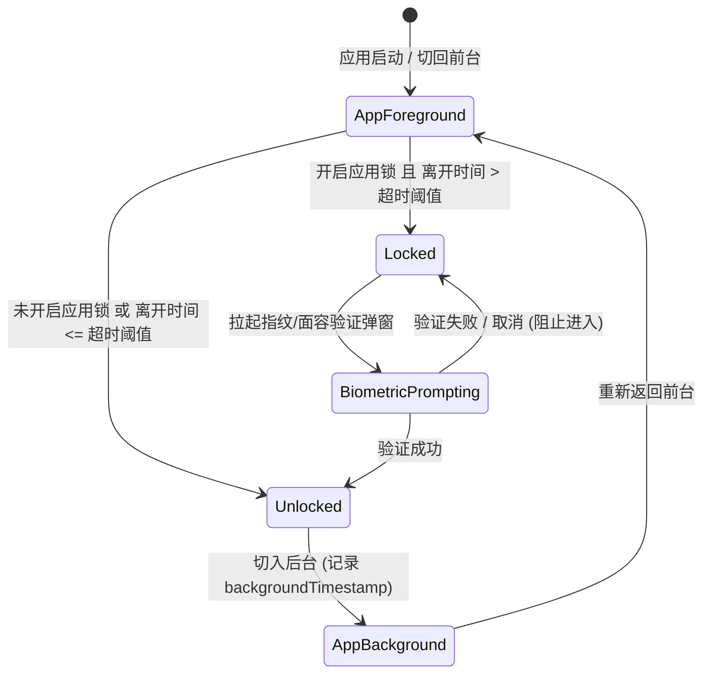

# 生物识别应用锁与隐私防窥设计与实现规范 (Biometric Security & Privacy Shield)

## 1. 概述 (Overview)

### 1.1 背景与痛点
记账数据涵盖个人收入水平、资产账户、消费习惯与隐私去向，属于高度敏感的个人数据。用户在公共场所使用手机、将手机临时借给他人或在切换多任务时，容易造成财务隐私外泄。

### 1.2 核心目标
1. **生物识别安全锁 (Biometric App Lock)**：基于 AndroidX `BiometricPrompt`，支持指纹/面容解锁；支持配置锁定时长（立即、1 分钟、5 分钟）。
2. **多任务防窥保护 (Recent Apps Shield)**：在切入系统多任务切换器时，自动模糊或隐藏界面，防止系统截屏泄漏敏感金额。
3. **极速防窥手势**：支持“摇一摇手机”或“双击结余卡片”快速切换全局隐额模式（***）。

---

## 2. 状态机与生命周期流转 (State Machine & Lifecycle Flow)



---

## 3. 技术实现与核心代码 (Implementation Details)

### 3.1 偏好设置项扩展 (DataStore Keys)
在 `BaseDataStoreManager.kt` 中引入：
* `KEY_BIOMETRIC_LOCK_ENABLED` (Boolean, 默认 false)
* `KEY_LOCK_TIMEOUT_SECONDS` (Int, 默认 0 秒 - 立即锁定；可选 60 秒、300 秒)
* `KEY_RECENT_APPS_SHIELD_ENABLED` (Boolean, 默认 true)

### 3.2 生物识别管理器 (BiometricSecurityManager)
```kotlin
package com.listen.expensetracker.core.security

import android.content.Context
import androidx.biometric.BiometricManager
import androidx.biometric.BiometricPrompt
import androidx.core.content.ContextCompat
import androidx.fragment.app.FragmentActivity

object BiometricSecurityManager {

    fun isBiometricAvailable(context: Context): Boolean {
        val biometricManager = BiometricManager.from(context)
        return biometricManager.canAuthenticate(
            BiometricManager.Authenticators.BIOMETRIC_STRONG or BiometricManager.Authenticators.DEVICE_CREDENTIAL
        ) == BiometricManager.BIOMETRIC_SUCCESS
    }

    fun promptUnlock(
        activity: FragmentActivity,
        title: String,
        subtitle: String,
        onSuccess: () -> Unit,
        onError: (String) -> Unit
    ) {
        val executor = ContextCompat.getMainExecutor(activity)
        val prompt = BiometricPrompt(activity, executor, object : BiometricPrompt.AuthenticationCallback() {
            override fun onAuthenticationSucceeded(result: BiometricPrompt.AuthenticationResult) {
                super.onAuthenticationSucceeded(result)
                onSuccess()
            }
            override fun onAuthenticationError(errorCode: Int, errString: CharSequence) {
                super.onAuthenticationError(errorCode, errString)
                onError(errString.toString())
            }
        })

        val promptInfo = BiometricPrompt.PromptInfo.Builder()
            .setTitle(title)
            .setSubtitle(subtitle)
            .setAllowedAuthenticators(
                BiometricManager.Authenticators.BIOMETRIC_STRONG or BiometricManager.Authenticators.DEVICE_CREDENTIAL
            )
            .build()

        prompt.authenticate(promptInfo)
    }
}
```

### 3.3 多任务防窥保护 (Recent Apps Shield)
在 `MainActivity.kt` 监听生命周期并动态切换窗口安全标记：
```kotlin
override fun onPause() {
    super.onPause()
    if (isRecentAppsShieldEnabled) {
        window.setFlags(WindowManager.LayoutParams.FLAG_SECURE, WindowManager.LayoutParams.FLAG_SECURE)
    }
}

override fun onResume() {
    super.onResume()
    if (!isBiometricLockActive) {
        window.clearFlags(WindowManager.LayoutParams.FLAG_SECURE)
    }
}
```

---

## 4. UI 与用户设置 (UI & Settings)

* **设置页「安全与隐私」独立卡片**：
  * 「生物识别应用锁」开关（若系统未录入指纹或不支持，置灰并给出提示）；
  * 「自动锁定时长」选择器（立即 / 1分钟后 / 5分钟后）；
  * 「多任务卡片隐私防窥」开关；
  * 「摇一摇快速隐藏金额」开关。
* **全局锁屏覆盖层 (`BiometricLockOverlay`)**：
  * 当 App 处于 `Locked` 状态时，覆盖一层毛玻璃背景，中央展示 App Logo 与「点击使用指纹解锁」安全提示，完全遮蔽底层账单数据。
