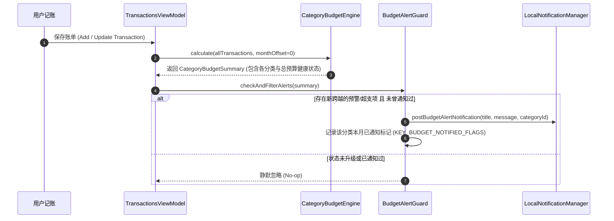

# 预算超支与健康度本地通知预警设计与实现规范 (Budget Overrun Notification Specification)

## 1. 概述 (Overview)

### 1.1 背景与痛点
虽然目前应用内在流水页卡片和分类预算中心提供了醒目的三态健康度（正常 `<80%`、预警 `80%~100%`、超支 `≥100%`），但当用户关闭 App 处于日常生活中时，如果单日多笔花销导致总预算或某个核心分类（如餐饮）突破警戒线，用户无法及时获知，从而错失控制开销的最佳时机。

### 1.2 核心目标
1. **即时本地通知预警**：当某次记账导致**月度总预算**或**任意分类预算**首次跨越 80% 预警线或 100% 超支线时，触发系统本地通知提醒。
2. **严格防骚扰与去重机制 (Anti-Spam & Dedup)**：同一月份、同一分类、同一警戒级别（80% / 100%）在当月仅通知 1 次，避免反复弹出打扰用户。
3. **通知直达预算管理中心**：点击通知通过 DeepLink 零延迟直达分类预算管理弹窗 (`CategoryBudgetModalDialog`)，方便用户查看明细或按需调整预算。

---

## 2. 预警决策架构与流转时序 (Alert Decision Flow)



---

## 3. 技术实现与防骚扰状态机 (Implementation Details)

### 3.1 通知渠道创建 (Notification Channels)
在应用启动或初始化时注册专属低频高权重的通知渠道：
```kotlin
package com.listen.expensetracker.core.notification

import android.app.NotificationChannel
import android.app.NotificationManager
import android.content.Context
import android.os.Build

object BudgetNotificationHelper {
    const val CHANNEL_ID_BUDGET_ALERTS = "channel_budget_alerts"

    fun createNotificationChannels(context: Context) {
        if (Build.VERSION.SDK_INT >= Build.VERSION_CODES.O) {
            val channel = NotificationChannel(
                CHANNEL_ID_BUDGET_ALERTS,
                "预算与超支预警",
                NotificationManager.IMPORTANCE_HIGH
            ).apply {
                description = "当月度总预算或分类支出达到 80% 警戒线或超支时发送提醒"
                enableLights(true)
                enableVibration(true)
            }
            val manager = context.getSystemService(Context.NOTIFICATION_SERVICE) as NotificationManager
            manager.createNotificationChannel(channel)
        }
    }
}
```

### 3.2 去重与状态判定 (BudgetAlertGuard)
```kotlin
package com.listen.expensetracker.features.budget.engine

import android.content.Context
import com.listen.expensetracker.data.model.BudgetHealthStatus
import com.listen.expensetracker.data.model.CategoryBudgetStatus

object BudgetAlertGuard {

    /**
     * 检查并触发预警通知
     * 格式形如: "2026_09:cat_food:WARNING", "2026_09:TOTAL:OVERRUN"
     */
    fun evaluateAndNotify(
        context: Context,
        monthKey: String, // e.g. "2026_09"
        totalExpense: Double,
        monthlyBudget: Double,
        categoryStatuses: List<CategoryBudgetStatus>,
        notifiedRecords: Set<String>,
        onNewAlert: (alertKey: String, title: String, message: String) -> Unit
    ) {
        if (monthlyBudget <= 0) return

        // 1. 检查总预算
        val totalRatio = totalExpense / monthlyBudget
        if (totalRatio >= 1.0) {
            val key = "$monthKey:TOTAL:OVERRUN"
            if (!notifiedRecords.contains(key)) {
                onNewAlert(key, "🚨 月度总预算已超支", "本月总支出已达 ¥${"%.0f".format(totalExpense)}，超出总预算 ¥${"%.0f".format(totalExpense - monthlyBudget)}，请注意节约开支！")
            }
        } else if (totalRatio >= 0.8) {
            val key = "$monthKey:TOTAL:WARNING"
            if (!notifiedRecords.contains(key)) {
                onNewAlert(key, "⚠️ 月度总预算预警", "本月总支出已达总预算的 ${(totalRatio * 100).toInt()}%，剩余额度已不足 20%。")
            }
        }

        // 2. 检查各分类预算
        categoryStatuses.forEach { cat ->
            if (cat.budgetAmount > 0) {
                if (cat.healthStatus == BudgetHealthStatus.OVERRUN) {
                    val key = "$monthKey:${cat.category.id}:OVERRUN"
                    if (!notifiedRecords.contains(key)) {
                        onNewAlert(key, "🚨 「${cat.category.displayName}」已超支", "本月该分类支出 ¥${"%.0f".format(cat.spentAmount)}，超出预算 ¥${"%.0f".format(cat.spentAmount - cat.budgetAmount)}。")
                    }
                } else if (cat.healthStatus == BudgetHealthStatus.WARNING) {
                    val key = "$monthKey:${cat.category.id}:WARNING"
                    if (!notifiedRecords.contains(key)) {
                        onNewAlert(key, "⚠️ 「${cat.category.displayName}」预算预警", "该分类支出已达到预算的 ${(cat.usageRatio * 100).toInt()}%。")
                    }
                }
            }
        }
    }
}
```

---

## 4. 权限申请与系统适配 (Permissions & System Compatibility)

1. **Android 13+ (API 33) 运行时权限适配**：在设置页开启「预算超支通知」时，按需请求 `POST_NOTIFICATIONS` 权限。
2. **通知点击意图构造**：
```kotlin
val intent = Intent(context, MainActivity::class.java).apply {
    action = Intent.ACTION_VIEW
    data = Uri.parse("lexpense://budget_center")
    flags = Intent.FLAG_ACTIVITY_NEW_TASK or Intent.FLAG_ACTIVITY_CLEAR_TOP
}
val pendingIntent = PendingIntent.getActivity(
    context,
    9001,
    intent,
    PendingIntent.FLAG_UPDATE_CURRENT or PendingIntent.FLAG_IMMUTABLE
)
```

---

## 5. 用户控制与设置项 (Settings)

* **设置页「预算管理」板块增设**：
  * 「预算超支与警戒预警通知」总开关（默认开启）；
  * 「分类预算超支时通知」二级开关；
  * 「总预算达到 80% 警戒线时通知」二级开关。
