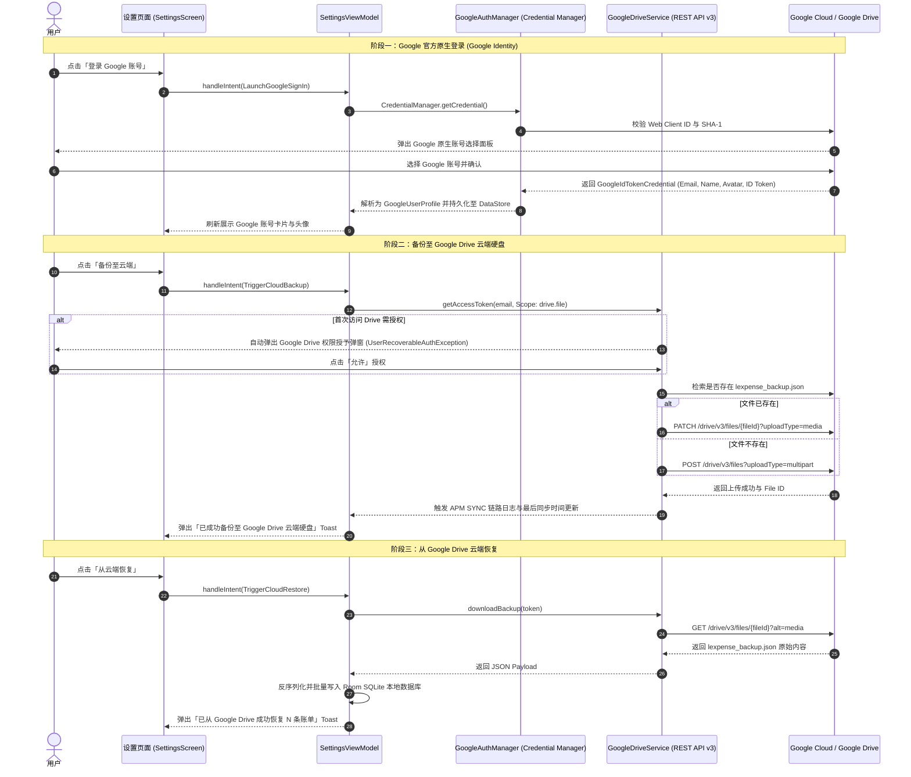

# Google 账号登录与 Google Drive 云端同步开发与操作指南

本文档系统性记录 **ListenExpenseTracker (lExpense)** 中集成 **Google 原生账号登录（AndroidX Credential Manager）** 与 **Google Drive REST API v3 云端硬盘备份恢复** 的完整实现细节、架构设计、Google Play App Signing 双层密钥体系与云端控制台排错指南。

---

## 1. 架构总览与工作流程

系统采用 **Google Identity (身份鉴权) + Google Drive REST API (云端存储)** 的解耦分层架构：



### 1.1 技术亮点与设计细节

1. **零废弃 API 的 Google Identity 整合 (Zero-Deprecated APIs)**：
   在 `GoogleAuthManager.kt` 中，全面舍弃了旧版的 `GoogleSignInClient`，采用了全新的 **AndroidX CredentialManager** 与 `GetGoogleIdOption`。通过统一的凭证入口，为用户提供原生的无缝身份验证体验。
2. **REST API v3 原生接入与授权守卫 (Authorization Guard)**：
   在 `GoogleDriveService.kt` 中，抛弃了笨重的 Google API Client 库，直接基于轻量级 HttpURLConnection 实现 Drive REST API v3 的访问。
   **难点突破**：在获取 `OAuth Token` 时，若由于权限变更等原因抛出 `UserRecoverableAuthException`，系统会通过该异常中的 `Intent` 自动弹出 Google 的原生授权修复弹窗，实现了自愈合的鉴权逻辑。
3. **通用云端同步状态机 (Universal Cloud Sync State Machine)**：
   由 `ListenArch` 提供的 `CloudSyncManager` 接管了全局的同步状态（IDLE, SYNCING, SUCCESS, ERROR）。它通过 `StateFlow<SyncState>` 向外广播状态流，使得任何 UI 界面都可以优雅地响应同步状态，且内置基于国际化 key (`sync_msg_syncing` 等) 的文案推送机制。

---

## 2. Google Cloud Console 凭据全矩阵配置（核心重点）

### 2.1 客户端 ID 配置核心原则
1. **代码中仅配置 1 个 Web 客户端 ID**：
   - 在 [`GoogleAuthManager.kt`](../app/src/main/java/com/listen/expensetracker/auth/GoogleAuthManager.kt) 中，`DEFAULT_WEB_CLIENT_ID` 必须配置为 **【Web 应用程序 (Web application)】** 类型的 OAuth 客户端 ID（用于获取 Audience / ID Token）。
2. **所有 Android 客户端 ID 仅需在 Google Cloud Console 中注册，代码中无需声明**：
   - 手机端底层的 Google Play Services 在调用登录时，会自动从手机系统层提取当前安装包的 `包名`（`com.listen.expensetracker`）和 `实际签名 SHA-1`，并在云端自动匹配放行。

### 2.2 Google Cloud Console 必须配置的 4 个 Android 客户端 ID 矩阵

为了确保在 **本地开发、CI 自动化打包、Google Play 内测分发、Google Play 正式上架** 4 大场景下 Google 登录均 100% 成功，必须在 [Google Cloud Console 凭据列表](https://console.cloud.google.com/apis/credentials) 的**同一个项目**下配置以下客户端：

| 客户端名称 | 应用类型 | 包名 | SHA-1 证书指纹 | 对应生效环境 |
| :--- | :--- | :--- | :--- | :--- |
| **Android - Play 当前密钥** | Android | `com.listen.expensetracker` | `B7:DD:48:E4:59:98:8C:B4:7B:42:B8:D7:D9:50:61:14:75:A5:45:08` | Google Play 商店正式版本 / 升级后版本 |
| **Android - Play 历史/内测密钥** | Android | `com.listen.expensetracker` | `31:3A:36:A4:C4:60:30:31:06:AF:95:CE:6D:81:6B:7B:BB:8C:35:A1` | Google Play 内部测试 / 内部应用分享 / 存量设备 |
| **Android - Release 上传密钥** | Android | `com.listen.expensetracker` | `38:71:09:AA:CE:E2:54:5B:9E:3A:F8:1F:54:38:99:CD:CD:E1:E9:93` | 本地 Release 打包 / GitHub Actions CI 直装 APK (`lExpense.jks`) |
| **Android - Debug 本地调试** | Android | `com.listen.expensetracker` | `D3:FC:90:5E:5D:05:C5:F8:0B:63:70:DD:C4:11:71:72:D3:02:3B:09` | Android Studio 开发者电脑直接 Run (`debug.keystore`) |
| **Web - 核心签发受众** | Web 应用程序 | - | `1069102462195-rjdheb5uqeb64o02ucan0lc65r0ammn6.apps.googleusercontent.com` | 代码中 `GoogleAuthManager` 统一填入此 ID |

---

## 3. Google Play App Signing 双层签名机制深度解析

Google Play 采用**上传密钥 (Upload Key)** 与 **应用签名密钥 (App Signing Key)** 分离机制：

```mermaid
flowchart TD
    A["开发者本地 / CI 构建"] -->|使用【上传密钥】(38:71:09...) 签名| B["打包成 AAB 上传到 Google Play"]
    B --> C{"Google Play 校验身份"}
    C -->|校验成功，剥离上传签名| D["Google Play 云端安全硬件模块 (HSM)"]
    D -->|使用【应用签名密钥 / 轮换密钥】重新签名| E["生成最终分发 APK"]
    E --> F["用户手机从 Google Play / 内部测试安装"]
    
    style A fill:#e1f5fe,stroke:#03a9f4
    style D fill:#fff3e0,stroke:#ff9800
    style F fill:#e8f5e9,stroke:#4caf50
```

1. **上传密钥 (Upload Key)**：
   - 对应代码库中的 `keystore/lExpense.jks`（SHA-1: `38:71:09...`）；
   - **作用**：仅作为向 Google Play 上传 AAB 时的身份凭据。
2. **应用签名密钥 (App Signing Key)**：
   - 由 Google Play 在云端托管管理；
   - **作用**：实际安装在用户手机上的 APK 携带的真实签名；
   - **历史密钥 (Previous Key)** 与 **当前密钥 (Current Key)** 均需加入 Google Cloud Console 以保证版本迁移平滑过渡。

---

## 4. 常见排错指南：`No credentials available` 深度诊断

当用户点击 Google 登录提示 `No credentials available` 时，按以下 5 步逐一排查：

### 步骤 1：排查当前手机 APK 的真实 SHA-1 与包名绑定
- **原因**：Google OAuth 规则是 **`包名` + `SHA-1` 双重强绑定**。如果 Google Cloud Console 中未录入当前 APK 签名的 SHA-1，或包名有误，就会返回此错误。
- **提取真机 SHA-1 命令**：
  ```powershell
  adb shell pm path com.listen.expensetracker
  adb pull <extracted-path>/base.apk temp.apk
  apksigner verify --print-certs temp.apk
  ```

### 步骤 2：检查是否为 Google Play 控制台的传统密钥
- 在 Google Play Console $\rightarrow$ 【设置】 $\rightarrow$ 【应用完整性】 $\rightarrow$ 【应用签名】中：
  - 复制 **【传统密钥】** 与 **【之前的应用签名密钥】** 下的 SHA-1；
  - 切勿复制后量子加密密钥。

### 步骤 3：清除手机端 Google Play 服务本地失败缓存
- **原因**：当首次登录因凭据未生效失败后，手机端 Google Play 服务会在本地将“无凭据”状态缓存数十分钟。
- **解决**：手机进入 `设置` $\rightarrow$ `应用管理` $\rightarrow$ `Google Play 服务` $\rightarrow$ `存储和缓存` $\rightarrow$ 点击 **「清除缓存」**，然后划掉杀掉 lExpense 重新打开。

### 步骤 4：检查 OAuth 同意屏幕的“测试用户”名单
- **原因**：当 Google Cloud Console 的 OAuth 同意屏幕发布状态为 **“测试中 (Testing)”** 时，任何不在「测试用户」列表中的 Google 邮箱都会被静默拦截。
- **解决**：进入 Google Cloud Console $\rightarrow$ 【OAuth 同意屏幕】 $\rightarrow$ 【测试用户】，添加测试用的 Gmail 邮箱。

### 步骤 5：等待全球 CDN 生效延迟（5 ~ 15 分钟）
- 新建或修改 OAuth Client ID 后，Google 全球分布式认证集群需要 5~15 分钟完成同步。
