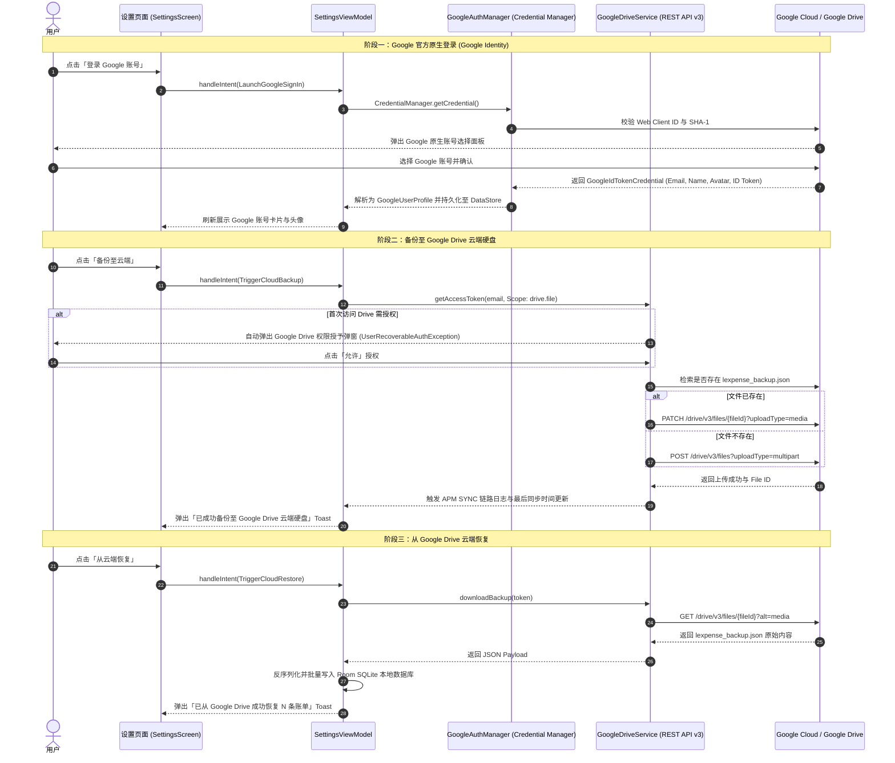

# Google 账号登录与 Google Drive 云端同步开发与操作指南

本文档系统性记录 **ListenExpenseTracker (lExpense)** 中集成 **Google 原生账号登录（AndroidX Credential Manager）** 与 **Google Drive REST API v3 云端硬盘备份恢复** 的完整实现细节、架构设计与云端控制台操作步骤。

---

## 1. 架构总览与工作流程

系统采用 **Google Identity (身份鉴权) + Google Drive REST API (云端存储)** 的解耦分层架构：



---

## 2. Google Cloud Console 控制台配置全步骤

### 2.1 启用 Google Drive API
1. 访问 [Google Cloud Console](https://console.cloud.google.com/) 并进入对应项目；
2. 导航至 **「API 与服务 (APIs & Services)」** $\rightarrow$ **「库 (Library)」**；
3. 搜索 **`Google Drive API`** 并点击 **「启用 (Enable)」**。

### 2.2 配置 OAuth 同意屏幕 (OAuth consent screen)
1. 进入 **「API 与服务」** $\rightarrow$ **「OAuth 同意屏幕」**；
2. 用户类型选择 **「外部 (External)」**，点击「创建」；
3. 填写应用名称（如 `lExpense`）和开发者联系邮箱；
4. **添加范围 (Scopes)**：
   - 点击 **「添加或移除范围 (Add or remove scopes)」**；
   - 勾选 **`https://www.googleapis.com/auth/drive.file`**（允许应用查看和管理其自行创建的 Google 云端硬盘文件）；
5. **添加测试用户 (Test Users)**：
   - 在开发/测试阶段，在 **「测试用户」** 列表中添加用于登录测试的 Google 邮箱（例如 `yourname@gmail.com`）。

### 2.3 创建凭据 (OAuth 客户端 ID)

必须创建 **2 类** OAuth 客户端 ID：

#### 1. Android 客户端 ID（用于设备端安全鉴权，Debug 与 Release 各建一个）
- 点击 **「+ 创建凭据」** $\rightarrow$ **「OAuth 客户端 ID」**；
- 应用类型选择：**Android**；
- 软件包名称：`com.listen.expensetracker`；
- **SHA-1 证书指纹提取命令**：
  - **Debug 指纹**：
    ```bash
    keytool -list -v -keystore ~/.android/debug.keystore -alias androiddebugkey -storepass android -keypass android
    ```
  - **Release 指纹**：
    ```bash
    keytool -list -v -keystore <path-to-your-release-keystore> -alias <your-alias>
    ```
  *(注：如果页面出现“此客户端不是 Google Play 商店应用”的提示，属于说明性提示，无需理会，直接点击页面底部的「创建」即可)*。

#### 2. Web 应用程序客户端 ID（用于签发 ID Token 与 Drive 令牌）
- 再次点击 **「+ 创建凭据」** $\rightarrow$ **「OAuth 客户端 ID」**；
- 应用类型选择：**Web 应用程序 (Web application)**；
- 名称：`lExpense Web Client`（其他选填项留空）；
- 点击「创建」，复制生成的 Web 客户端 ID（格式如：`<YOUR_CLIENT_ID>.apps.googleusercontent.com`），并配置到 `GoogleAuthManager` 中。

---

## 3. Android 核心代码实现架构

### 3.1 依赖项配置 (`app/build.gradle.kts`)
```kotlin
dependencies {
    // 现代凭据管理器与 Google Identity
    implementation("androidx.credentials:credentials:1.3.0")
    implementation("androidx.credentials:credentials-play-services-auth:1.3.0")
    implementation("com.google.android.libraries.identity.googleid:googleid:1.1.1")
    
    // Google Play Auth (用于获取 Google Drive OAuth 2.0 Access Token)
    implementation("com.google.android.gms:play-services-auth:21.3.0")
}
```

### 3.2 权限声明 (`AndroidManifest.xml`)
```xml
<manifest xmlns:android="http://schemas.android.com/apk/res/android">
    <uses-permission android:name="android.permission.INTERNET" />
    <uses-permission android:name="android.permission.ACCESS_NETWORK_STATE" />
</manifest>
```

### 3.3 核心类文件与职责

| 文件路径 | 核心职责 |
| :--- | :--- |
| [`GoogleAuthManager.kt`](file:///C:/Users/liste/Downloads/github/ListenExpenseTracker/app/src/main/java/com/listen/expensetracker/auth/GoogleAuthManager.kt) | 封装 AndroidX Credential Manager，配置 `GetGoogleIdOption` 与 Web Client ID，解析登录返回的 `GoogleUserProfile`。 |
| [`GoogleDriveService.kt`](file:///C:/Users/liste/Downloads/github/ListenExpenseTracker/app/src/main/java/com/listen/expensetracker/data/cloud/GoogleDriveService.kt) | Google Drive REST API v3 轻量级客户端。负责获取 OAuth Bearer Token、搜索 `lexpense_backup.json`、Multipart 文件上传、PATCH 更新与 GET 下载，并捕获 `UserRecoverableAuthException` 动态拉起授权弹窗。 |
| [`SettingsViewModel.kt`](file:///C:/Users/liste/Downloads/github/ListenExpenseTracker/app/src/main/java/com/listen/expensetracker/features/settings/viewmodel/SettingsViewModel.kt) | 编排 MVI 业务流程，调用 `TransactionBackupManager` 序列化数据并联动 `GoogleDriveService` 执行真实云端备份与恢复。 |
| [`SettingsCloudSection.kt`](file:///C:/Users/liste/Downloads/github/ListenExpenseTracker/app/src/main/java/com/listen/expensetracker/features/settings/components/SettingsCloudSection.kt) | 纯声明式 UI 卡片，展示 Google 账号头像、同步状态指标、备份与恢复按钮，并自适应主题强调色。 |

---

## 4. 常见问题排查与 FAQ

### Q1: 点击备份时提示 `missing INTERNET permission`？
- **原因**：应用未在 `AndroidManifest.xml` 中声明网络访问权限。
- **解决**：在 Manifest 文件中加入 `<uses-permission android:name="android.permission.INTERNET" />`。

### Q2: 点击备份时提示“请在弹出的 Google 授权窗口中点击允许”？
- **原因**：Google 安全机制规定，首次访问云端硬盘文件时，需要用户显式确认 Drive 授权。
- **解决**：系统会自动弹出 Google 官方授权对话框，点击「允许」后再次点击备份即可。

### Q3: Google Drive 网页端在哪里查看备份文件？
- 登录 [Google Drive 网页端](https://drive.google.com/)；
- 在顶部搜索栏输入 **`lexpense_backup.json`** 即可查看；文件采用标准 JSON 格式，可随时下载核对。
