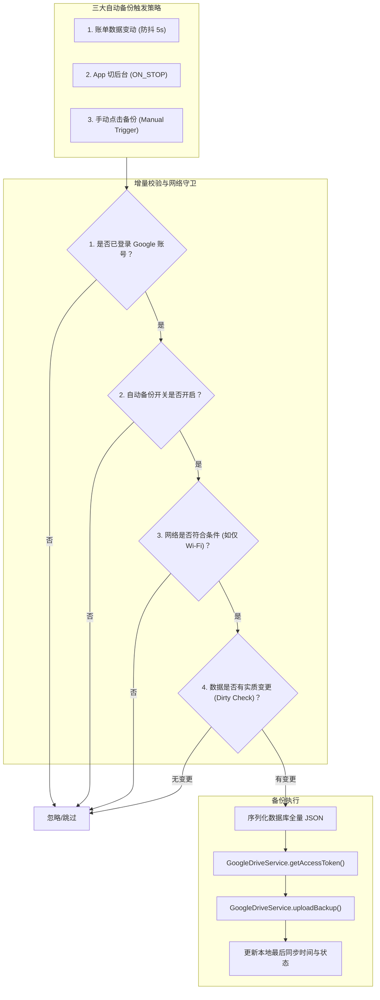

# Google Drive 自动备份功能设计规范 (Google Drive Auto-Backup Specification)

## 1. 概述 (Overview)

本规范详细定义了 ListenExpenseTracker 在用户登录 Google 账号后的**Google Drive 自动备份机制**。该功能致力于提供**零打扰、高可靠、省电省流**的数据安全同步体验，确保用户的记账数据实时、安全地沉淀在个人的 Google 云端硬盘（`lexpense_backup.json`）中。

---

## 2. 核心架构与触发机制 (Architecture & Trigger Strategy)

---

## 3. 详细设计规范

### 3.1 触发时机
1. **数据变动防抖触发（Mutation-Driven with 5s Debounce）**：
   - 当用户在流水页完成「新增账单」、「编辑账单」、「删除账单」、「恢复撤销」或批量导入时，触发 5 秒防抖计时器。
   - 连续记账时（如连续记 3 笔），计时器自动重置，待用户停止操作 5 秒后在后台静默发起一次合并上传。
2. **应用切后台触发（Lifecycle `ON_STOP` Trigger）**：
   - 监听 `ProcessLifecycleOwner` 或 Activity `onStop`。若存在未同步的本地数据变动，切到后台时立即派发后台同步任务。
3. **手动兜底触发（Manual Trigger）**：
   - 设置页保留「立即备份」与「从云端恢复」按钮。

### 3.2 节能与省流优化（Dirty Check & Battery Guard）
- **脏数据检测（Dirty Check）**：
  - 维护 `lastBackupDataHash`（基于本地交易总条数、最大修改时间戳或内容 MD5/SHA-256）。
  - 若自上次备份以来本地数据未发生任何变化，直接跳过网络请求，避免无意义的电量和流量消耗。
- **网络约束（Wi-Fi Only Guard）**：
  - 支持用户开启「仅在 Wi-Fi 下自动备份」选项。在蜂窝数据网络下自动推迟备份，连上 Wi-Fi 后自动补发。

### 3.3 技术实现难点与亮点 (Implementation Highlights)
1. **轻量级协程防抖 (Coroutine-based Debounce)**：
   在 `GoogleDriveAutoBackupManager` 中，利用全局 `CoroutineScope(SupervisorJob() + Dispatchers.IO)` 管理异步任务。通过 `pendingDebounceJob?.cancel()` 结合 `delay(5000L)`，极为优雅地实现了防抖逻辑，避免了短时间内高频修改引发的网络洪峰。
2. **基于 SHA-256 的强一致性脏数据检查**：
   在序列化数据库全量 JSON 之后，采用 `MessageDigest` 计算 SHA-256 摘要（Hash），并与 DataStore 中的 `lastBackupHash` 比对。这确保了只要数据内容（含字符级别的细微变动）一致就不上传，极大节省了网络流量和云端存储配额。
3. **精准的网络状态探测**：
   通过 Android 现代的 `ConnectivityManager` 和 `NetworkCapabilities`，精确探测当前活动网络是否包含 `TRANSPORT_WIFI`，杜绝了由于传统 `NetworkInfo` 废弃导致的判断不准确问题。

### 3.4 存储与权限隔离
- **权限最小化**：仅申请 `https://www.googleapis.com/auth/drive.file` Scope。
- **文件命名与隔离**：在 Google Drive 根目录下创建并覆盖 `lexpense_backup.json`，不会窥探或干扰用户的其他任何个人云端文件。

---

## 4. UI / UX 规范

在「设置 $\rightarrow$ 云端同步（SettingsCloudSection）」中：
1. **自动备份开关 (`Switch`)**：
   - 标题：`自动备份到 Google Drive`
   - 副标题：`账单变动或退出应用时，自动静默同步至云端硬盘`
   - 默认开启（登录 Google 账号后）。
2. **仅 Wi-Fi 开关**：
   - 标题：`仅在 Wi-Fi 下自动备份`
   - 默认关闭。
3. **状态呈现**：
   - 同步中：微型转圈加载动效 + `正在同步到云端...`
   - 同步完成：绿色对勾 + `上次同步时间：YYYY-MM-DD HH:mm`
