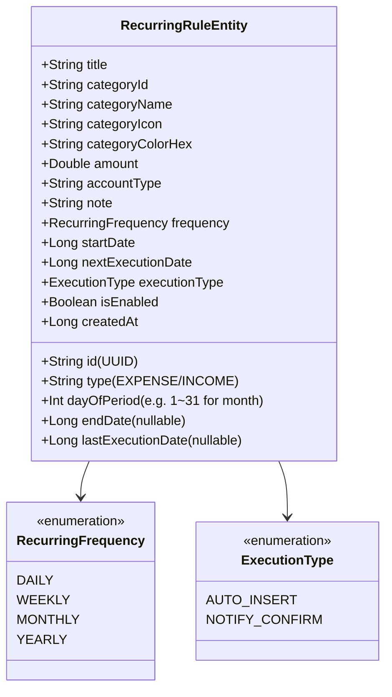
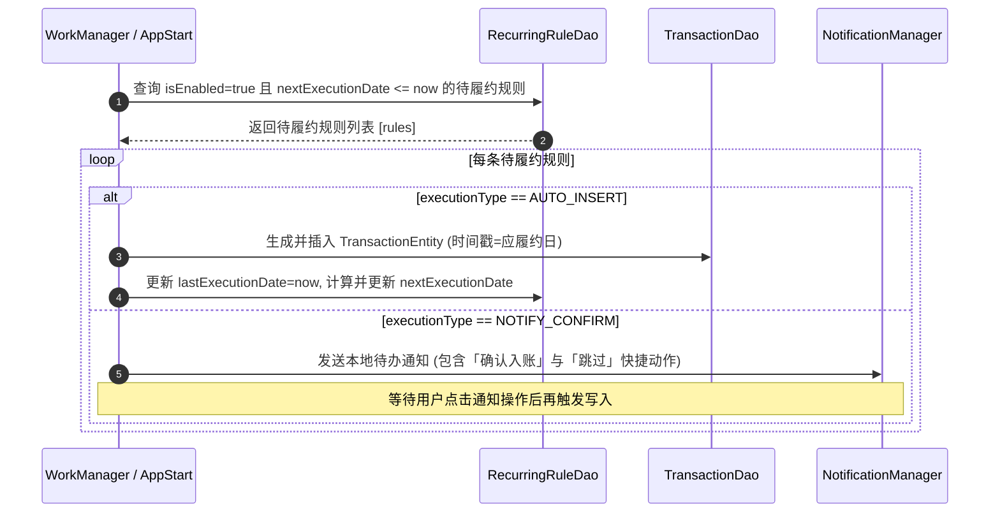

# 周期性收支与订阅管理设计与实现规范 (Recurring Transactions & Subscriptions Design)

## 1. 概述 (Overview)

### 1.1 背景与痛点
个人记账过程中存在大量高频、重复的固定收支场景（如发薪日、每月房租/房贷、固定车贷、五险一金、宽带费以及 iCloud/Netflix/Spotify/外卖月卡等各类订阅服务）。用户每次手动录入繁琐、容易遗漏，且缺乏对**每月刚性生活成本 Baseline** 的直观认知。

### 1.2 核心目标
1. **自动化/半自动化履约**：支持按天、周、月（固定某日）、年配置周期规则，到期支持「自动无感记账」或「本地通知确认后一键记账」。
2. **固定成本看板**：直观汇总每月固定支出总额及占月度预算的比重。
3. **高可靠触发**：结合 AndroidX `WorkManager` 周期守护与 App 冷启动自检双重保障，确保断网、关机重启后不漏记、不重记。

---

## 2. 架构分层与数据模型 (Data Architecture)



### 2.1 核心数据实体 (RecurringRuleEntity)
```kotlin
package com.listen.expensetracker.data.db

import androidx.room.Entity
import androidx.room.PrimaryKey
import java.util.UUID

enum class RecurringFrequency {
    DAILY, WEEKLY, MONTHLY, YEARLY
}

enum class ExecutionType {
    AUTO_INSERT,      // 到期自动直接插入数据库
    NOTIFY_CONFIRM    // 到期发送通知提醒，用户确认后记入
}

@Entity(tableName = "recurring_rules")
data class RecurringRuleEntity(
    @PrimaryKey
    val id: String = UUID.randomUUID().toString(),
    val title: String,                           // 规则标题（如 "房租"、"Netflix 订阅"）
    val type: String = TransactionType.EXPENSE,  // EXPENSE / INCOME
    val categoryId: String,
    val categoryName: String,
    val categoryIcon: String,
    val categoryColorHex: String,
    val amount: Double,
    val accountType: String = "CASH",
    val note: String = "",
    val frequency: RecurringFrequency = RecurringFrequency.MONTHLY,
    val dayOfPeriod: Int = 1,                    // 月周期为 1~31 号；周周期为 1~7
    val startDate: Long = System.currentTimeMillis(),
    val endDate: Long? = null,                   // 结束日期（null 表示长期有效）
    val lastExecutionDate: Long? = null,         // 上次履约时间戳
    val nextExecutionDate: Long,                 // 下次应履约时间戳
    val executionType: ExecutionType = ExecutionType.AUTO_INSERT,
    val isEnabled: Boolean = true,
    val createdAt: Long = System.currentTimeMillis()
)
```

### 2.2 DAO 数据访问接口 (RecurringRuleDao)
```kotlin
package com.listen.expensetracker.data.db

import androidx.room.*
import kotlinx.coroutines.flow.Flow

@Dao
interface RecurringRuleDao {
    @Query("SELECT * FROM recurring_rules ORDER BY nextExecutionDate ASC")
    fun getAllRulesFlow(): Flow<List<RecurringRuleEntity>>

    @Query("SELECT * FROM recurring_rules WHERE isEnabled = 1 AND nextExecutionDate <= :currentTime")
    suspend fun getDueRules(currentTime: Long): List<RecurringRuleEntity>

    @Query("SELECT * FROM recurring_rules WHERE id = :id LIMIT 1")
    suspend fun getRuleById(id: String): RecurringRuleEntity?

    @Insert(onConflict = OnConflictStrategy.REPLACE)
    suspend fun insertRule(rule: RecurringRuleEntity)

    @Update
    suspend fun updateRule(rule: RecurringRuleEntity)

    @Delete
    suspend fun deleteRule(rule: RecurringRuleEntity)
}
```

---

## 3. 调度与履约工作流 (Execution Workflow)



### 3.1 下次执行时间递推算法 (Next Execution Calculation)
针对每月 29/30/31 号（如 2 月只有 28 天）等边界情况进行防溢出归一化处理：
```kotlin
fun calculateNextExecutionDate(frequency: RecurringFrequency, dayOfPeriod: Int, fromDate: Long): Long {
    val cal = Calendar.getInstance().apply {
        timeInMillis = fromDate
        set(Calendar.HOUR_OF_DAY, 9)
        set(Calendar.MINUTE, 0)
        set(Calendar.SECOND, 0)
        set(Calendar.MILLISECOND, 0)
    }

    do {
        when (frequency) {
            RecurringFrequency.DAILY -> cal.add(Calendar.DAY_OF_YEAR, 1)
            RecurringFrequency.WEEKLY -> {
                cal.add(Calendar.WEEK_OF_YEAR, 1)
                val targetCalendarDay = when (dayOfPeriod) {
                    1 -> Calendar.MONDAY
                    2 -> Calendar.TUESDAY
                    3 -> Calendar.WEDNESDAY
                    4 -> Calendar.THURSDAY
                    5 -> Calendar.FRIDAY
                    6 -> Calendar.SATURDAY
                    else -> Calendar.SUNDAY
                }
                cal.set(Calendar.DAY_OF_WEEK, targetCalendarDay)
            }
            RecurringFrequency.MONTHLY -> {
                cal.add(Calendar.MONTH, 1)
                val maxDay = cal.getActualMaximum(Calendar.DAY_OF_MONTH)
                cal.set(Calendar.DAY_OF_MONTH, dayOfPeriod.coerceIn(1, maxDay))
            }
            RecurringFrequency.YEARLY -> {
                cal.add(Calendar.YEAR, 1)
            }
        }
    } while (cal.timeInMillis <= fromDate)

    return cal.timeInMillis
}
```

### 3.2 每月生活成本基线计算 (Monthly Baseline Calculation)
将不同执行周期的金额精确归一化为每月度折算金额：
* **每日**：`金额 * 30.0`
* **每周**：`金额 * (52.0 / 12.0)`
* **每月**：`金额`
* **每年**：`金额 / 12.0`

---

## 4. UI 界面与交互架构设计 (UI & Component Architecture)

为解决列表横向拥挤、金额与长标题折行冲突、以及表单垂直高度溢出问题，系统采用了全方位的紧凑型与响应式排版架构，且所有组件严格遵守单文件 $\le 250$ 行的架构约束。

### 4.1 统一模态容器 (`RecurringTransactionsDialog.kt`)
* 采用 `AnimatedContent` 平滑水平滑动（`slideInHorizontally` + `fadeIn`）在 **规则列表态 (`LIST`)** 与 **规则编辑态 (`EDIT`)** 之间无缝切换。
* 固定视窗容器高度为 `420.dp`，彻底消除不同状态间弹窗跳动，底部按键始终对齐，无滚动溢出与空白闲置。

### 4.2 固定支出看板卡片 (`RecurringOverviewCard.kt`)
* 顶部总览卡片：清晰展示月度固定支出金额（`TextHeader` 粗体加高亮色）。
* 展示固定成本占月总预算百分比与定期支出总笔数；若未设定预算则引导配置。

### 4.3 高效空间利用的规则卡片设计 (`RecurringRuleItemCard.kt`)
采用独创的**三层紧凑无挤压排版 (Three-Tier Compact Layout)**，兼顾极长规则名称展示与完整金额可见度：

```
+--------------------------------------------------------------+
| [图标 28dp] 规则名称独占整行横向空间，同行无其他任何元素         |
|             最多展示 2 行，文字折行自然不被挤压               |
|                                                              |
| [每月 15日]  [微信支付]  3天后扣款                    |      |
|                                                    [Switch]  |
| -¥1,299.00 (加粗完整金额，靠左顶格)                 |      |
+--------------------------------------------------------------+
```

* **第 1 行（标题行）**：`[分类图标 28dp]` + `规则名称` 占满卡片 100% 宽度，**同行绝无 Switch、金额或徽标等其他元素干扰**，支持最多展示 2 行（`maxLines = 2`），长标题自然折行，永不截断。
* **第 2 行（属性徽标行）**：`[每月 15日]` 周期徽标、`[微信支付]` 支付账户徽标与 `[3天后]` 倒计时靠左顶格平铺展示。
* **第 3 行（完整金额行）**：左侧展示未缩略加粗金额（`TextTitle`，如 `-¥1,299.00`），带色彩区分与正负号。
* **右侧垂直居中 Switch**：将第 2 行与第 3 行作为一个整体内容块（`weight(1f)`），右侧的启停 `Switch` 与之进行垂直居中对齐（`verticalAlignment = Alignment.CenterVertically`），视觉均衡且无冗余留白。

### 4.4 规则表单与全频次选择组件 (`RecurringRuleEditContent.kt` & `RecurringFrequencySelector.kt`)
1. **一体化输入表单卡片 (Grouped Card)**：
   * 将规则名称与每期金额合并在一个带有浅色细分割线的圆角卡片内，高度从原本的 112dp+ 压缩至 84dp。
   * 配置专用的数字小数软键盘与最大金额防溢出校验 (`MAX_RECURRING_AMOUNT = 999,999.99`)。
2. **全频次周期与水平滚动选择器 (`RecurringFrequencySelector.kt`)**：
   * 频次分段切换：支持 **每天 / 每周 / 每月 / 每年** 4 档。
   * 周模式：提供 `[周一] ~ [周日]` 水平滑动药丸。
   * 月模式：配备 `[-] XX日 [+]` 步进调节与 `[1日] [5日] [10日] [15日] [20日] [25日] [月末]` 高频快捷药丸，**全采用 `horizontalScroll` 水平滚动**，彻底避免小屏换行挤压。
3. **独立状态模型 (`RecurringEditState.kt`)**：
   * 表单状态与 Composable 渲染解耦，独立出纯 Kotlin 状态持有类，保障单文件行数合规。

---

## 5. 异常保护与防重策略 (Guard & Edge Cases)

1. **自动记账标识与防重（Idempotent Note Tagging）**：
   * 自动履约生成的交易记录在 `note` 字段前置添加 `[周期]` 标记（如 `[周期] 房租`）。
   * 明细列表 (`TransactionItemRow.kt`) 自动解析该前缀，并以专用紫色 `[周期]` 徽标高亮显示，与普通手工记账清晰区隔。
2. **月末与闰年边界处理**：
   * 固定扣款日支持 28 日（月末归一）。遇到 2 月或 30 天小月份时，通过 `Calendar.getActualMaximum` 动态将扣款日对齐当月最后一天，杜绝跨月溢出 Bug。
3. **断网关机与补偿推进**：
   * 冷启动自动扫描时，`timestamp` 取 `min(nextExecutionDate, now)`，并在记录流水后立即通过 `do-while` 循环将 `nextExecutionDate` 推进至当前时间之后的下一个有效周期，彻底防止单次死循环或重复插入。
4. **演示演练数据内置 (Demo Data)**：
   * 演练数据引擎 (`DemoDataEngine`) 支持同步预置常用周期规则（如每月 5 日发薪、每月 10 日房租、每月 15 日 Netflix 会员），便于用户和测试人员开箱体验。

---

## 6. 自动化测试与工程验证 (Testing & Verification)

本模块已编写完整的单元测试套件：
* `RecurringRuleEntityTest.kt`：覆盖规则创建、状态修改、周期枚举、默认值及数据映射验证。
* `RecurringTransactionEngineTest.kt`：
  * 周期性执行时间计算（按天、按周几、按月、跨年、跨月末及闰年测试）。
  * 自动到期批量履约入账逻辑与 `[周期]` 标记测试。
  * 每月固定生活成本折算与总支出 Baseline 算法准确性测试。
* 全部测试通过 `./gradlew.bat testDebugUnitTest` 自动化回归验证。
