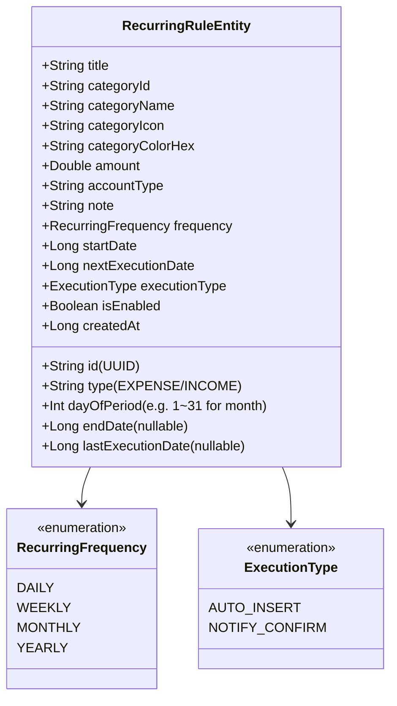
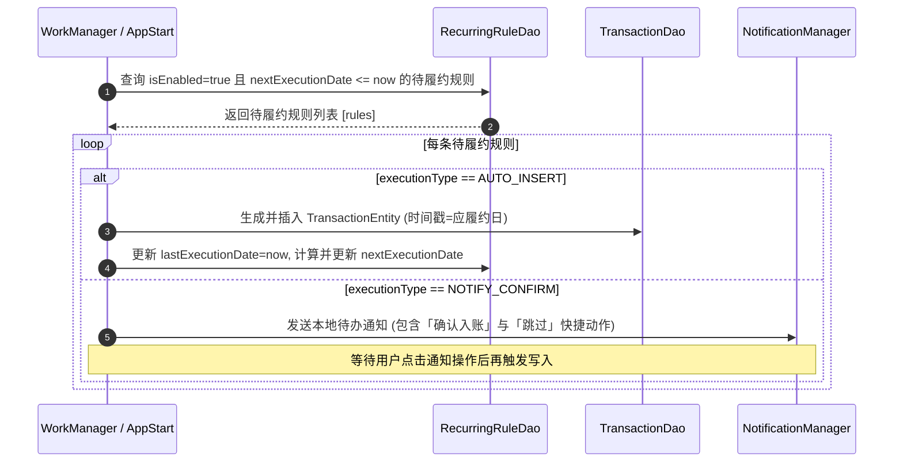

# 周期性收支与订阅管理设计与实现规范 (Recurring Transactions & Subscriptions Design)

## 1. 概述 (Overview)

### 1.1 背景与痛点
个人记账过程中存在大量高频、重复的固定收支场景（如发薪日、每月房租/房贷、固定车贷、五险一金、宽带费以及 iCloud/Netflix/Spotify/外卖月卡等各类订阅服务）。用户每次手动录入繁琐、容易遗漏，且缺乏对**每月刚性生活成本 Baseline** 的直观认知。

### 1.2 核心目标
1. **自动化/半自动化履约**：支持按天、周、月（固定某日）、年配置周期规则，到期支持「自动无感记账」或「本地通知确认后一键记账」。
2. **固定成本看板**：直观汇总每月固定支出总额及占月度预算的比重。
3. **高可靠触发**：结合 AndroidX `WorkManager` 周期守护与 App 冷启动自检双重保障，确保断网、关机重启后不漏记、不重记。

---

## 2. 架构分层与数据模型 (Data Architecture)



### 2.1 核心数据实体 (RecurringRuleEntity)
```kotlin
package com.listen.expensetracker.data.db

import androidx.room.Entity
import androidx.room.PrimaryKey
import java.util.UUID

enum class RecurringFrequency {
    DAILY, WEEKLY, MONTHLY, YEARLY
}

enum class ExecutionType {
    AUTO_INSERT,      // 到期自动直接插入数据库
    NOTIFY_CONFIRM    // 到期发送通知提醒，用户确认后记入
}

@Entity(tableName = "recurring_rules")
data class RecurringRuleEntity(
    @PrimaryKey
    val id: String = UUID.randomUUID().toString(),
    val title: String,                           // 规则标题（如 "房租"、"Netflix 订阅"）
    val type: String = TransactionType.EXPENSE,  // EXPENSE / INCOME
    val categoryId: String,
    val categoryName: String,
    val categoryIcon: String,
    val categoryColorHex: String,
    val amount: Double,
    val accountType: String = "CASH",
    val note: String = "",
    val frequency: RecurringFrequency = RecurringFrequency.MONTHLY,
    val dayOfPeriod: Int = 1,                    // 月周期为 1~31 号；周周期为 1~7
    val startDate: Long = System.currentTimeMillis(),
    val endDate: Long? = null,                   // 结束日期（null 表示长期有效）
    val lastExecutionDate: Long? = null,         // 上次履约时间戳
    val nextExecutionDate: Long,                 // 下次应履约时间戳
    val executionType: ExecutionType = ExecutionType.AUTO_INSERT,
    val isEnabled: Boolean = true,
    val createdAt: Long = System.currentTimeMillis()
)
```

### 2.2 DAO 数据访问接口 (RecurringRuleDao)
```kotlin
package com.listen.expensetracker.data.db

import androidx.room.*
import kotlinx.coroutines.flow.Flow

@Dao
interface RecurringRuleDao {
    @Query("SELECT * FROM recurring_rules ORDER BY nextExecutionDate ASC")
    fun getAllRulesFlow(): Flow<List<RecurringRuleEntity>>

    @Query("SELECT * FROM recurring_rules WHERE isEnabled = 1 AND nextExecutionDate <= :currentTime")
    suspend fun getDueRules(currentTime: Long): List<RecurringRuleEntity>

    @Query("SELECT * FROM recurring_rules WHERE id = :id LIMIT 1")
    suspend fun getRuleById(id: String): RecurringRuleEntity?

    @Insert(onConflict = OnConflictStrategy.REPLACE)
    suspend fun insertRule(rule: RecurringRuleEntity)

    @Update
    suspend fun updateRule(rule: RecurringRuleEntity)

    @Delete
    suspend fun deleteRule(rule: RecurringRuleEntity)
}
```

---

## 3. 调度与履约工作流 (Execution Workflow)



### 3.1 下次执行时间递推算法 (Next Execution Calculation)
针对每月 29/30/31 号（如 2 月只有 28 天）等边界情况进行防溢出归一化处理：
```kotlin
fun calculateNextExecutionDate(frequency: RecurringFrequency, dayOfPeriod: Int, fromDate: Long): Long {
    val cal = Calendar.getInstance().apply { timeInMillis = fromDate }
    when (frequency) {
        RecurringFrequency.DAILY -> cal.add(Calendar.DAY_OF_YEAR, 1)
        RecurringFrequency.WEEKLY -> {
            cal.add(Calendar.WEEK_OF_YEAR, 1)
            cal.set(Calendar.DAY_OF_WEEK, dayOfPeriod)
        }
        RecurringFrequency.MONTHLY -> {
            cal.add(Calendar.MONTH, 1)
            val maxDay = cal.getActualMaximum(Calendar.DAY_OF_MONTH)
            cal.set(Calendar.DAY_OF_MONTH, dayOfPeriod.coerceAtMost(maxDay))
        }
        RecurringFrequency.YEARLY -> cal.add(Calendar.YEAR, 1)
    }
    cal.set(Calendar.HOUR_OF_DAY, 9)
    cal.set(Calendar.MINUTE, 0)
    cal.set(Calendar.SECOND, 0)
    cal.set(Calendar.MILLISECOND, 0)
    return cal.timeInMillis
}
```

---

## 4. UI 界面与交互设计 (UI & Interaction)

### 4.1 周期账单中心 (RecurringCenterDialog / Screen)
* **顶部固定成本卡片**：
  * 显示：`每月固定支出 ¥4,280.00` | `占月预算 42.8%` | `共 5 项订阅/定期支出`。
* **规则列表项 (`RecurringRuleItemRow`)**：
  * 左侧分类图标（彩色光晕背景）与规则标题、周期标签（如 `每月 10 号`）。
  * 右侧展示单次金额与下次扣款倒计时（如 `3 天后`）。
  * 包含快捷启用/停用 Switch 开关与点击编辑入口。
* **规则新建/编辑弹窗 (`RecurringRuleEditDialog`)**：
  * 规则名称输入框、收支类型切换、金额输入、分类选择器、账户选择器。
  * 周期频次选择（每天/每周几/每月几号）。
  * 履约模式切换：单选「到期自动记账」或「发送通知提醒确认」。

---

## 5. 异常保护与防重策略 (Guard & Edge Cases)

1. **断网与关机补偿（Idempotent Catch-up）**：用户关机 3 天后再开机，WorkManager 触发时针对漏掉的周期按天补齐或合并生成，且通过记录 `lastExecutionDate` 严格防止单周期重复插入。
2. **时区变更适配**：时间戳存储与计算均基于系统本地日历 `Calendar` 处理，避免跨夏令时/时区漂移。
