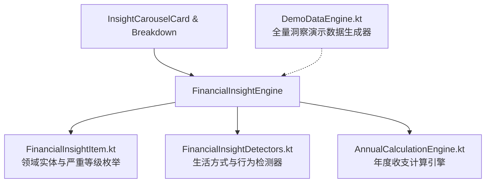

# 智能财务洞察与深度环比分析设计与实现规范 (Smart Financial Insights & MoM)

## 1. 概述 (Overview)

### 1.1 背景与痛点
现有统计图表（饼图、折线图、排行榜）能够较好呈现单月的静态收支构成，但用户在资产管理时需要更立体的智能诊断：
1. **跨月度开销趋势**：本月相比上月花多了还是花少了？哪个分类开销涨幅最明显？
2. **收支结余健康度**：本月储蓄率是否达标，还是已经出现超支赤字？
3. **日常行为习惯与生活方式洞察**：周末是否发生报复性高额消费？日常高频小额「拿铁因子」日积月累消耗了多少资金？本月有多少天实现了零支出自律？
4. **分类失衡与异常峰值**：是否有某单一分类吞噬了近半预算？哪一天发生了决定性的开销波峰？

### 1.2 核心目标
1. **收支结余与赤字预警 (Savings Rate & Deficit)**：衡量储蓄率健康度（结余 $\ge 20\%$ 为健康，支出大于收入为赤字警报）。
2. **月度环比分析引擎 (MoM Comparison)**：计算总支出相比上月同期的差值与变动率（$> +12\%$ 为预警，$< -12\%$ 为节流优异）。
3. **智能预算消耗预测与节流表现 (Burn Rate & Frugal Progress)**：推算总预算耗尽日期，或表彰节流进度。
4. **单项分类过度倾斜检测 (Category Dominance)**：单分类支出 $\ge 45\%$ 时提示分类配置失衡。
5. **突发分类异动排查 (Category Spike)**：单分类环比增长 $> 1.8\times$ 且基数 $> 50$ 元。
6. **周末消费偏好分析 (Weekend Shift)**：周末日均支出 $\ge 1.6\times$ 工作日且周末总额 $> 100$ 元。
7. **拿铁因子累积分析 (Latte Factor)**：微额支出（$\le 35$ 元）频次 $\ge 6$ 次时计算微额总负担。
8. **零支出自律天数统计 (No-Spend Discipline Days)**：统计当月未发生支出的健康自律天数。
9. **模拟数据全量覆盖验证 (Demo Data Coverage)**：一键生成的演示数据能够 100% 触发并完整展现上述各类洞察卡片。

---

## 2. 模块化架构设计 (Modular Architecture)

为确保代码严格遵循单文件 $\le 250$ 行规范并保持高内聚低耦合，财务洞察体系拆分为三层：

### 2.1 文件职责划分
1. `FinancialInsightItem.kt`: 包含 `InsightSeverity`（INFO, POSITIVE, WARNING, DANGER）、`FinancialInsightItem` 领域模型及 `AnnualMonthSummary`。
2. `FinancialInsightDetectors.kt`: 封装 `detectSavingsRate`、`detectWeekendSpendingShift`、`detectLatteFactor`、`detectNoSpendDays` 等高内聚行为检测规则。
3. `FinancialInsightEngine.kt`: 主门面引擎，负责统筹生成月度全部洞察项及年度总览。
4. `DemoDataEngine.kt`: 构造具备周末消费偏好、拿铁因子、分类倾斜、单日峰值及结余健康的拟真演示数据。

---

## 3. 洞察规则与判定阈值 (Insight Detection Rules)

| 洞察类型 | 标识 ID | 触发条件 | 严重等级 | 交互动作 |
| :--- | :--- | :--- | :--- | :--- |
| **健康储蓄率** | `insight_savings_rate` | 收入 > 0 且储蓄率 $\ge 20\%$ | POSITIVE | - |
| **收支赤字警告** | `insight_deficit` | 总支出 > 总收入 | DANGER | - |
| **月支出环比上涨** | `insight_mom_increase` | 当月支出较上月同期上涨 $> 12\%$ | WARNING | - |
| **月支出环比节流** | `insight_mom_decrease` | 当月支出较上月同期节省 $> 12\%$ | POSITIVE | - |
| **预算耗尽预警** | `insight_burn_rate` | 当月日均支出推算整月将超预算 | WARNING | 点击跳转修改预算 |
| **预算节流良好** | `insight_budget_frugal` | 当前天数 $\ge 8$ 天且推算支出 $\le$ 预算 70% | POSITIVE | 点击查看预算进度 |
| **单分类过度倾斜** | `insight_cat_dominant_*` | 单项分类支出 $\ge 45\%$ 总支出 | WARNING | 点击跳转筛选该分类 |
| **突发分类跃升** | `insight_cat_jump_*` | 单分类环比增长 $> 1.8\times$ 且基数 $> 50$ 元 | INFO | 点击跳转筛选该分类 |
| **周末消费倾斜** | `insight_weekend_shift` | 周末日均支出 $\ge 1.6\times$ 工作日日均 | INFO | - |
| **拿铁因子累积** | `insight_latte_factor` | $\le 35$ 元小额支出笔数 $\ge 6$ 笔 | INFO | - |
| **单日最大峰值** | `insight_peak_day` | 单日开销 $\ge 35\%$ 当月总支出 | INFO | 点击跳转定位该日 |
| **零支出自律天数** | `insight_no_spend_days` | 当月未发生任何支出的天数 $\ge 3$ 天 | POSITIVE | - |
| **平稳运行兜底** | `insight_steady_state` | 未触发任何警示/异动时的健康状态卡片 | POSITIVE / DANGER | - |

---

## 4. UI 呈现与用户交互 (UI Presentation)

### 4.1 统计页顶部「财务洞察卡片轮播 (Insight Carousel)」
* 横向卡片轮播滑动展示，右下角带有高可读性分页胶囊（如 `1/8`）；
* 情绪化色彩体系：
  * `POSITIVE`: 翡翠绿轻透明背景 + 向上趋势/勋章图标；
  * `WARNING`: 琥珀暖黄背景 + 闪电/预警图标；
  * `DANGER`: 珊瑚玫红背景 + 警报图标；
  * `INFO`: 科技深蓝背景 + 放大镜/日历图标；
* 支持穿透下钻（分类异动直接筛选流水、峰值日期直接跳转定位该天、预算卡片直接呼出预算设置）。

### 4.2 模拟数据演示生成策略 (Demo Data Strategy)
在开发/演示模式下点击「生成模拟数据」时，系统会自洽构造具备以下特征的数据集：
1. **真实月薪 (16,000 元)**：保证储蓄率达 85%（触发 `insight_savings_rate`）；
2. **周末集中大额数码消费 (1,350 元) + 演唱会门票 (480 元)**：触发 `insight_peak_day`、`insight_weekend_shift`、`insight_cat_dominant`、`insight_cat_jump`；
3. **工作日注入 6 笔 $\le 35$ 元的小额咖啡与通勤**：触发 `insight_latte_factor`；
4. **控制消费集中在 3 个特定日期**：当月其余日期均为无支出自律日（触发 `insight_no_spend_days`）；
5. **注入上月低基准对比数据 (1,240 元)**：确保环比增长达 81.9%（触发 `insight_mom_increase`）。
从而使用户可在轮播卡片中完整体验到全部 8 种核心智能洞察。
