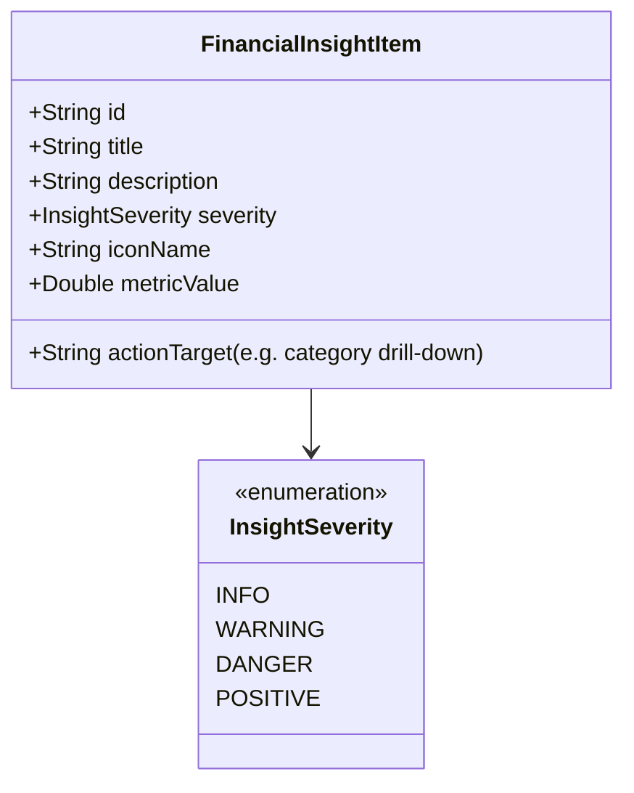

# 智能财务洞察与深度环比分析设计与实现规范 (Smart Financial Insights & MoM)

## 1. 概述 (Overview)

### 1.1 背景与痛点
现有统计图表（饼图、折线图、排行榜）能够较好呈现单月的静态收支构成，但用户无法直观了解：
1. **跨月度开销趋势**：本月相比上月花多了还是花少了？哪个分类开销涨幅最明显？
2. **预算消耗健康度预警**：按照目前的日常花销速度，本月什么时候会提前花光预算？
3. **异常消费波峰**：哪一天的单日消费出现异常峰值，是什么原因引起的？

### 1.2 核心目标
1. **月度环比分析引擎 (MoM Comparison)**：计算总支出与各分类相比上月同期的绝对差值与百分比变动。
2. **智能预算消耗速率预测 (Burn Rate Predictor)**：基于当前日历天数与每日平均斜率，测算预算消耗倒计时。
3. **统计页高阶视图**：顶部轮播呈现「财务洞察卡片 (Insight Cards)」与「年度 12 个月收支走势 (Annual Overview)」柱状走势图。

---

## 2. 算法与数据模型 (Algorithms & Data Models)



### 2.1 洞察卡片领域模型 (FinancialInsightItem)
```kotlin
package com.listen.expensetracker.data.engine

enum class InsightSeverity {
    INFO,       // 提示信息（如：本月收入已结清）
    POSITIVE,   // 积极向好（如：本月支出比上月同期减少 23.4%）
    WARNING,    // 警示注意（如：按照当前消费速度，预计 9月22日 耗尽预算）
    DANGER      // 危险超支（如：餐饮分类已超出本月预算 120%）
}

data class FinancialInsightItem(
    val id: String,
    val title: String,
    val description: String,
    val severity: InsightSeverity,
    val categoryId: String? = null,
    val targetDay: Int? = null,
    val diffPercentage: Float? = null
)
```

### 2.2 核心诊断算法 (FinancialInsightEngine)
```kotlin
package com.listen.expensetracker.data.engine

import com.listen.expensetracker.data.db.TransactionEntity
import com.listen.expensetracker.data.db.TransactionType
import java.util.Calendar

object FinancialInsightEngine {

    /**
     * 生成当前月份的智能洞察列表
     */
    fun generateInsights(
        allTransactions: List<TransactionEntity>,
        currentOffset: Int,
        monthlyBudget: Double,
        categoryRatios: Map<String, Float>,
        lang: String
    ): List<FinancialInsightItem> {
        val insights = mutableListOf<FinancialInsightItem>()

        val (currentStart, currentEnd, _) = TransactionCalculationEngine.getMonthRangeAndTitle(currentOffset, lang)
        val (prevStart, prevEnd, _) = TransactionCalculationEngine.getMonthRangeAndTitle(currentOffset - 1, lang)

        val currentExpenses = allTransactions.filter { it.timestamp in currentStart..currentEnd && it.type == TransactionType.EXPENSE }
        val prevExpenses = allTransactions.filter { it.timestamp in prevStart..prevEnd && it.type == TransactionType.EXPENSE }

        val currentTotal = currentExpenses.sumOf { it.amount }
        val prevTotal = prevExpenses.sumOf { it.amount }

        // 1. 月环比总支出对比 (MoM Total Analysis)
        if (prevTotal > 0 && currentTotal > 0) {
            val diff = (currentTotal - prevTotal) / prevTotal
            val pct = "%.1f".format(kotlin.math.abs(diff * 100))
            if (diff > 0.15) {
                insights.add(FinancialInsightItem(
                    id = "insight_mom_increase",
                    title = "支出环比增长较快",
                    description = "当前总开销已比上月同期多支出 $pct%，请注意控制花销节奏。",
                    severity = InsightSeverity.WARNING,
                    diffPercentage = (diff * 100).toFloat()
                ))
            } else if (diff < -0.15) {
                insights.add(FinancialInsightItem(
                    id = "insight_mom_decrease",
                    title = "节流表现优异",
                    description = "当前总开销比上月同期节省了 $pct%，请继续保持！",
                    severity = InsightSeverity.POSITIVE,
                    diffPercentage = (diff * 100).toFloat()
                ))
            }
        }

        // 2. 预算消耗速率预测 (Burn Rate Predictor)
        val nowCal = Calendar.getInstance()
        val currentDay = nowCal.get(Calendar.DAY_OF_MONTH)
        val maxDays = nowCal.getActualMaximum(Calendar.DAY_OF_MONTH)
        if (currentOffset == 0 && monthlyBudget > 0 && currentDay in 3..(maxDays - 2)) {
            val dailyAvg = currentTotal / currentDay
            val estimatedTotal = dailyAvg * maxDays
            if (estimatedTotal > monthlyBudget && currentTotal < monthlyBudget) {
                val exhaustedDay = (monthlyBudget / dailyAvg).toInt().coerceIn(currentDay, maxDays)
                insights.add(FinancialInsightItem(
                    id = "insight_burn_rate",
                    title = "预算预警预测",
                    description = "按照当前每日平均开销（¥${"%.0f".format(dailyAvg)}/天），预计将在本月 ${exhaustedDay} 日耗尽总预算。",
                    severity = InsightSeverity.WARNING,
                    targetDay = exhaustedDay
                ))
            }
        }

        // 3. 分类开销异常跃升排查
        val currentCatMap = currentExpenses.groupBy { it.categoryId }.mapValues { it.value.sumOf { tx -> tx.amount } }
        val prevCatMap = prevExpenses.groupBy { it.categoryId }.mapValues { it.value.sumOf { tx -> tx.amount } }
        currentCatMap.forEach { (catId, amt) ->
            val prevAmt = prevCatMap[catId] ?: 0.0
            if (prevAmt > 50.0 && amt > prevAmt * 1.8) {
                val catName = currentExpenses.firstOrNull { it.categoryId == catId }?.categoryName ?: catId
                insights.add(FinancialInsightItem(
                    id = "insight_cat_jump_$catId",
                    title = "分类开销异动",
                    description = "「$catName」本月支出已达上月的 ${(amt / prevAmt).toInt()} 倍（当前 ¥${"%.0f".format(amt)}），为近期增长最快项。",
                    severity = InsightSeverity.INFO,
                    categoryId = catId
                ))
            }
        }

        return insights
    }
}
```

---

## 3. UI 呈现与用户交互 (UI Presentation)

### 3.1 统计页顶部「财务洞察卡片轮播 (Insight Carousel)」
* 横向单卡轮播展示，右下角带有 `1/3` 分页胶囊；
* 根据 `InsightSeverity` 着色：
  * `POSITIVE`: 翡翠绿轻透明背景 + 📈 趋势图标；
  * `WARNING`: 琥珀金背景 + ⚡ 预警图标；
  * `DANGER`: 珊瑚红背景 + 🚨 警报图标；
* 点击卡片支持穿透下钻（例如轻触异动分类卡片，直接跳转至流水页并定位该分类）。

### 3.2 年度 12 个月收支总览视图 (Annual Overview Chart)
* 在统计页顶部提供 `[ 按月查看 ] | [ 年度总览 ]` 切换器；
* 呈现 12 根并列收支双柱状图（绿色代表收入，红色代表支出），点击具体月份快速跳入该月详细面板。
